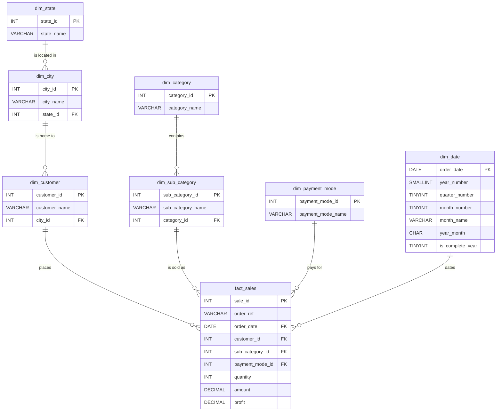

# Entity-Relationship Diagram — `sales_trend`

Checkpoint 1, Task 1.3. Star schema: one fact table at the grain of a
single transaction line, surrounded by six dimensions. `PK` marks a
primary key, `FK` a foreign key.

## Relationships in words

| Parent | Child | Cardinality | Meaning |
| --- | --- | --- | --- |
| `dim_state` | `dim_city` | 1 : many | Each of the 6 states holds 3 cities. |
| `dim_city` | `dim_customer` | 1 : many | Each customer belongs to exactly one city. |
| `dim_category` | `dim_sub_category` | 1 : many | Each of the 3 categories holds 4 sub-categories. |
| `dim_customer` | `fact_sales` | 1 : many | A customer can appear on many transaction lines. |
| `dim_sub_category` | `fact_sales` | 1 : many | A sub-category is sold on many lines. |
| `dim_payment_mode` | `fact_sales` | 1 : many | A payment method is used on many lines. |
| `dim_date` | `fact_sales` | 1 : many | A calendar date carries many lines. |

## Design notes

- **Grain.** One row of `fact_sales` is one product line on one order. All
  measures (`quantity`, `amount`, `profit`) are additive at this grain.
- **Surrogate key.** The raw `Order ID` is reused across different dates
  and customers, so it cannot be a primary key. It is retained as the
  descriptive column `order_ref` and the table is keyed on `sale_id`.
- **Why a date dimension.** Pre-computing year, quarter, month and the
  `is_complete_year` flag keeps the trend queries free of dialect-specific
  date functions and makes the partial-2025 exclusion explicit rather than
  buried in a `WHERE` clause on raw dates.
- **Snowflaked dimensions.** Geography (`state → city → customer`) and
  product (`category → sub_category`) are kept as separate tables rather
  than flattened, so that Task 1.4 has genuine multi-table joins to
  demonstrate and so a city can be renamed in one place.
