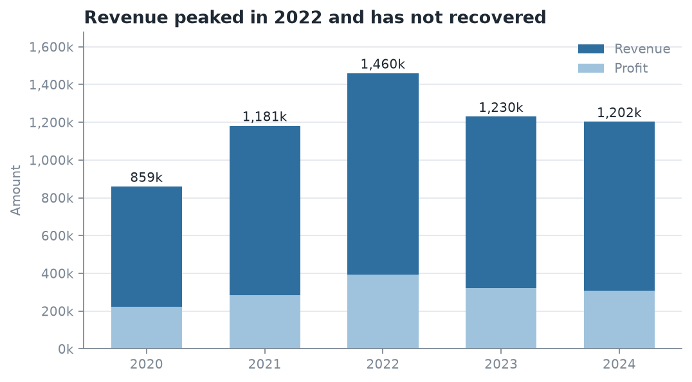
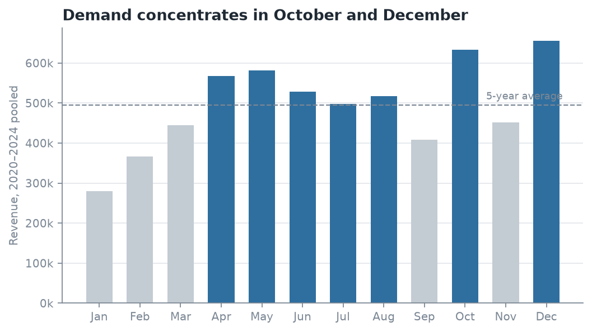
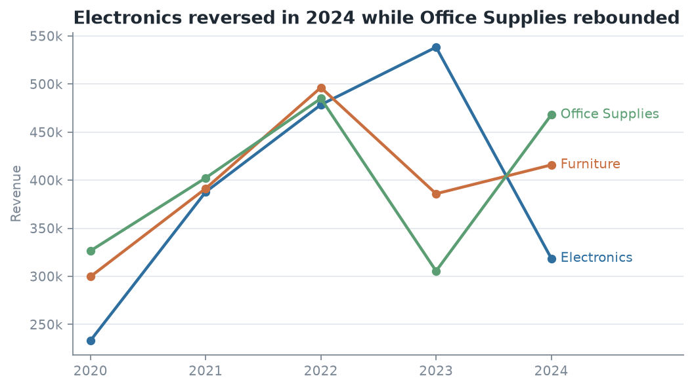

# Sales Trend Analysis for a Multi-Category Retailer

## BA Capstone Project — Checkpoint 1: Data Fundamentals & SQL Querying

**Talibon Polytechnic College**

**Course Code & Title:** BED 106 — Business Analytics

**Academic Year / Semester:** A.Y. 2026–2027 · 1st Semester

**Instructor:** Jessie A. Melendres

**Business Domain:** Retail & Sales Analytics

**Group Name / Number:** _______________________

**Date of Submission:** _______________________

**Group Members & Roles**

Caption: Group members and assigned project roles.

| Member Name | Role |
| --- | --- |
| _______________________ | Project Lead / Analyst |
| _______________________ | Data Engineer |
| _______________________ | Statistician / Modeler |
| _______________________ | BI Developer / Visualizer |

---

# Task 1.1 — Business Problem Statement

## Business Domain & Problem Investigation

**Industry:** Multi-category retail (consumer electronics, furniture and office
supplies) operating across six US states — California, Florida, Illinois, New
York, Ohio and Texas.

**Core business problem.** The company grew out of 2020 and then stopped.
On a like-for-like monthly basis revenue rose 30.9% between 2020 and 2022,
from 92,934 to 121,648 per month, but has fallen in each of the two years
since, ending 2024 at 100,207 per month — **17.6% below the 2022 peak**.
(2020 is measured per month because the dataset begins on 22 March 2020 and
covers only nine complete months of that year; comparing its part-year total
against a full year would overstate the growth.) Overall margin has stayed flat in a narrow
23.97%–26.93% band throughout, so the problem is not that the company is selling
at worse prices; it is that the *volume and mix of what it sells* have shifted
in a way management has not yet diagnosed.

Because reporting to date has been a single company-wide revenue figure per
year, nobody can say whether the plateau is a market-wide slowdown, a seasonal
artefact, or a handful of specific product lines falling away. Those three
explanations call for completely different responses, and the company currently
cannot tell them apart.

**What this project does.** It rebuilds five years of transaction history into a
queryable relational warehouse and decomposes the trend along three axes —
time, product hierarchy, and geography — so that the plateau can be attributed
to specific product lines and specific periods rather than described in
aggregate.

## Business Impact & Significance

- **Revenue.** The gap between the 2022 peak and 2024 actuals is 257,297 per
  year. Recovering even half of it is worth roughly 128,000 annually, which is
  material against a five-year total of 5.91 million across the 57 complete
  months analysed.
- **Inventory efficiency.** Demand is heavily concentrated: October and December
  alone carry 21.8% of annual revenue, and Q4 as a whole carries 29.4%. Stocking
  to a flat monthly average guarantees both stockouts in the peak and dead
  capital in January, the weakest month at 4.72% of the year.
- **Purchasing decisions.** Category performance has diverged sharply. Knowing
  that Electronics fell 40.8% in 2024 while Office Supplies rose is the
  difference between an across-the-board purchasing cut and a targeted one.
- **Reporting credibility.** A documented, constraint-enforced schema replaces
  ad-hoc spreadsheet pivots, so every number in a management report can be
  traced back to a query and a source row.

## Key Business Questions

1. **How have revenue and profit trended year over year from 2020 to 2024, and
   is the company still growing?** *(Answered by Q3, Figure 1.)*
2. **Which product categories and sub-categories are driving the trend, and
   which ones reversed direction most recently?** *(Answered by Q5, Q7,
   Figure 3.)*
3. **When during the year does demand concentrate, and is that seasonal pattern
   the same for every category?** *(Answered by Q4, Q8, Figure 2.)*

Supporting questions: which cities return the most revenue per customer (Q6),
and which bulk orders are being sold at the thinnest margins (Q2).

## Data Source Overview

Historical point-of-sale transaction records — one row per product line on an
order — obtained as a public CSV export in the Kaggle "Sales Dataset" format.
The file covers 22 March 2020 to 15 March 2025 and carries order identifiers,
dates, customer names, geography, a two-level product hierarchy, payment
method, and the three measures: quantity, amount and profit.

---

# Task 1.2 — Dataset Documentation

## Data Source Report

Caption: Data source report for the sales transaction dataset.

| Attribute | Details |
| --- | --- |
| Dataset Name | Sales Dataset (multi-category US retail transactions) |
| Source URL/File | `archive.zip → Sales Dataset.csv`, public Kaggle-format sales export. Stored in this repository as `data/raw/sales_dataset_raw.csv` |
| Date Accessed | 24 August 2026 |
| License Type | Public/open dataset, used here for academic coursework only. _Confirm and record the exact licence shown on the source page before submission._ |
| File Size | 1,194 data rows × 12 columns |
| Coverage | 22 March 2020 – 15 March 2025 |
| Currency | **Not stated in the source file.** `Amount` and `Profit` are unitless integers; all figures in this report are quoted as currency units. |

## Data Dictionary

Caption: Data dictionary — column name, data type and description.

| Column Name | Data Type | Description |
| --- | --- | --- |
| Order ID | VARCHAR(20) | Order reference label, e.g. `B-26776`. **Not unique** — see quality notes. |
| Amount | INTEGER → DECIMAL(12,2) | Revenue for the transaction line. Range 508–9,992. |
| Profit | INTEGER → DECIMAL(12,2) | Gross profit for the line. Range 50–4,930. |
| Quantity | INTEGER | Units sold on the line. Range 1–20. |
| Category | VARCHAR(60) | Top product level: Electronics, Furniture, Office Supplies. |
| Sub-Category | VARCHAR(60) | Second product level, 12 values, e.g. Printers, Sofas, Paper. |
| PaymentMode | VARCHAR(40) | COD, Credit Card, Debit Card, EMI, UPI. |
| Order Date | DATE | Transaction date, ISO `YYYY-MM-DD`. 648 distinct dates. |
| CustomerName | VARCHAR(120) | Customer full name, 802 distinct values. Not a unique key. |
| State | VARCHAR(60) | One of 6 US states. |
| City | VARCHAR(60) | One of 18 cities, 3 per state. |
| Year-Month | CHAR(7) | `YYYY-MM`. Fully derivable from Order Date — dropped as redundant. |

## Preliminary Data Quality Assessment

Full evidence, regenerated from the raw file on every build, is in
`reports/data_quality_report.md`.

**Missing Values.** None. All 12 columns are complete across all 1,194 rows, so
no imputation or row-dropping was required.

**Duplicates.**
- Zero fully identical rows.
- 36 rows repeat the same (Order ID, Order Date, CustomerName, Sub-Category)
  combination. These were **kept**: one customer can legitimately buy two items
  from the same sub-category on one order, and the amounts differ between them.
- `Order ID` is **not unique** — 547 distinct values spread over 1,194 rows, and
  194 of those values appear against more than one order date *and* a different
  customer name. It cannot function as a primary key.

**Inconsistencies.**
- `Year-Month` duplicates information already in `Order Date` (0 mismatches
  across 1,194 rows) — redundant storage and a future update anomaly.
- `CustomerName` is not a reliable identifier: 5 names appear in more than one
  city, so name alone cannot key a customer.
- **Both ends of the series are partial.** Data runs 22 March 2020 to 15 March
  2025, so **March 2020 and March 2025 are part-months** and **2020 is a
  nine-month year**. Two distinct traps follow. Read naively, the 44 rows of
  2025 look like an 80% collapse in demand; and comparing 2020's part-year
  total against a full 2021 overstates growth (69.9% raw versus 30.9% on a
  like-for-like monthly basis). Including the 10-day March 2020 in a monthly
  average also drags that month's seasonal index down by 15%. `dates` carries
  two flags, `is_complete_year` and `is_complete_month`, and every trend query
  filters on them.
- **Limitation worth stating — the dataset is synthetic.** Four independent
  signals: zero loss-making lines across 1,194 rows and five years; 22 of the 802
  distinct customer names ending in a credential suffix (MD, DDS, PhD), the
  signature of a name generator rather than a real customer list; US cities paired with UPI and EMI,
  which are Indian payment systems; and a near-uniform payment mix (206–260
  lines each). Real retail data of this size would contain returns, discounts
  and loss-making orders. The *methodology* here is sound, but the specific
  figures should be presented as a modelling exercise rather than a real
  company's results.
- **Privacy note.** Because the customer names are generated, there is no data
  subject behind them and they are not personal data, so R.A. 10173 (Data
  Privacy Act) is not engaged. The reason is that the names are synthetic, not
  that the file was publicly downloadable — public availability is not consent.

**Cleaning Steps Applied.**

1. Trimmed whitespace and normalised casing on all text labels (`State`,
   `City`, `Category`, `Sub-Category`, `CustomerName`).
2. Cast `Amount`, `Profit`, `Quantity` to numeric types and `Order Date` to a
   true `DATE`.
3. Dropped the redundant `Year-Month` column; rebuilt year, quarter, month and
   month name in `dates`.
4. Replaced `Order ID` as a key with the surrogate primary key `sale_id`,
   retaining the original value as the descriptive column `order_ref`.
5. Keyed customers on (name, city) rather than name alone.
6. Added `dates.is_complete_year` and `dates.is_complete_month` so every
   trend query excludes the partial 2025 year and the two part-months
   (March 2020, March 2025) explicitly rather than by convention.
7. Split the flat file into seven dimension tables and one fact table with
   enforced foreign keys; the build fails on any referential-integrity
   violation (`PRAGMA foreign_key_check`).

All steps are executable and repeatable: `python3 scripts/clean_and_load.py`.

## Raw Dataset Preview — first 10 rows

Caption: Raw dataset preview, first rows as received.

| Order ID | Amount | Profit | Qty | Category | Sub-Category | PaymentMode | Order Date | CustomerName | State | City | Year-Month |
| --- | --- | --- | --- | --- | --- | --- | --- | --- | --- | --- | --- |
| B-26776 | 9726 | 1275 | 5 | Electronics | Electronic Games | UPI | 2023-06-27 | David Padilla | Florida | Miami | 2023-06 |
| B-26776 | 9726 | 1275 | 5 | Electronics | Electronic Games | UPI | 2024-12-27 | Connor Morgan | Illinois | Chicago | 2024-12 |
| B-26776 | 9726 | 1275 | 5 | Electronics | Electronic Games | UPI | 2021-07-25 | Robert Stone | New York | Buffalo | 2021-07 |
| B-26776 | 4975 | 1330 | 14 | Electronics | Printers | UPI | 2023-06-27 | David Padilla | Florida | Miami | 2023-06 |

_(Rows 1–3 above are exactly the evidence for the duplicate-key problem: one
`Order ID`, three different dates, three different customers in three different
states. Insert the full 10–20 row screenshot from your CSV viewer here.)_

---

# Task 1.3 — Relational Database Design

## Entity-Relationship Diagram (ERD)

The full diagram, in Mermaid source that renders directly on GitHub, is in
`docs/erd.md`. Structure:

```
states ──< cities ──< customers ──┐
                                          │
categories ──< sub_categories ────────┼──< sales
                                          │
payment_modes ─────────────────────────┤
                                          │
dates ─────────────────────────────────┘
```

**Star schema, 8 tables.** `sales` is the **fact table** — it holds the additive
measures (`quantity`, `amount`, `profit`) at a grain of one transaction line.
The other seven are **dimension tables**, holding the descriptive attributes
those measures are sliced by. The tables are named plainly rather than with
`fact_`/`dim_` prefixes; the roles come from the design, not the names.

Caption: Entity relationships and cardinality in the sales_trend schema.

| Parent | Child | Cardinality |
| --- | --- | --- |
| `states` | `cities` | 1 : many |
| `cities` | `customers` | 1 : many |
| `categories` | `sub_categories` | 1 : many |
| `customers` | `sales` | 1 : many |
| `sub_categories` | `sales` | 1 : many |
| `payment_modes` | `sales` | 1 : many |
| `dates` | `sales` | 1 : many |

**Why this design.** Every key business question in Task 1.1 has the form "a
measure, sliced by a dimension, over time" — which a star schema answers in one
join hop. Geography and product are kept snowflaked (`state → city → customer`,
`category → sub_category`) rather than flattened, so a city or category label
lives in exactly one place and Task 1.4 has genuine multi-table joins to
demonstrate.

## Database Schema & Population

DDL: `sql/01_schema_mysql.sql` (MySQL 8, InnoDB, with `PRIMARY KEY`,
`FOREIGN KEY`, `UNIQUE` and `CHECK` constraints plus four indexes on the
columns the Task 1.4 queries filter and group by).
Data: `sql/03_insert_data.sql` (generated, portable `INSERT` statements).

A single file, `sql/02_mysql_full_import.sql`, creates the database, all eight
tables with their constraints, and loads all the data. In phpMyAdmin it goes
through the Import tab; from a terminal:

```
mysql -u root -p < sql/02_mysql_full_import.sql
mysql -u root -p sales_trend < sql/04_queries.sql
```

The import ends with its own verification block, whose final row must read
`1194 | 6182639.00 | 547 | 57 | 0 | 0` — the last two columns are orphan-row
counts, so zeros are proof of referential integrity.

**Populated row counts (verified after load):**

Caption: Populated row counts verified after load.

| Table | Rows |
| --- | --- |
| `states` | 6 |
| `cities` | 18 |
| `categories` | 3 |
| `sub_categories` | 12 |
| `payment_modes` | 5 |
| `customers` | 807 |
| `dates` | 648 |
| `sales` | 1,194 |

The schema creates **8 primary keys, 7 foreign keys, 6 unique constraints and
4 check constraints**, all verified on a live MySQL-compatible server; both
foreign keys and check constraints were confirmed to reject invalid rows.

`sales` holds exactly the 1,194 rows of the raw file — no transaction was
lost or invented in normalisation. `customers` has 807 rows against 802
distinct names, the 5 extra rows being the names that appear in more than one
city.

_(Insert your MySQL Workbench screenshots of `SHOW TABLES;` and
`SELECT COUNT(*) FROM sales;` here.)_

---

# Task 1.4 — SQL Query Report

All eight queries are in `sql/04_queries.sql`; every result table below is
machine-generated output from `scripts/run_queries.py`, reproduced in full in
`reports/query_results.md`. Queries are written in portable SQL and run
unchanged on MySQL 8 and SQLite 3.

## 1. Basic Data Retrieval

### Q1 — Largest transaction lines of the most recent complete year
`SELECT` / `WHERE` / `ORDER BY` on `sales`.

**Business Interpretation.** The 15 biggest lines of 2024 sit in a tight band
from 9,380 to 9,914, against a dataset-wide maximum of 9,992 — so there is a
hard ceiling near 10,000 rather than a long tail of outliers. This is a business
of many mid-sized orders, not a few whales, which means no single lost account
can explain the revenue decline.

Profit on those lines varies enormously, from 414 to 4,339 on near-identical
revenue: sale 1008 returned 414 on 9,380 (4.4% margin) while sale 1092 returned
4,339 on 9,609 (45.2%). Order size alone is therefore a poor proxy for value,
and any "top customer" report ranked on revenue would point management at
exactly the wrong accounts.

### Q2 — Bulk orders sold at thin margins
`SELECT` / `WHERE` / `ORDER BY` with a computed margin column.

**Business Interpretation.** These are lines of 15+ units returning under 15%
margin — the company moving maximum stock for minimum return. The worst, sale 8,
shipped 19 units for 7,702 in revenue and just 60 in profit, a 0.78% margin;
all 15 lines shown return under 3.7%. They are the first candidates for a
price-floor or volume-discount review, since a recovery of even two percentage
points on high-quantity lines compounds quickly across the order book.

Note that these thin-margin bulk lines appear in every year from 2020 to 2024,
not only the declining years, so they are a standing pricing issue rather than a
cause of the trend break identified in Q3.

## 2. Aggregate Analysis

### Q3 — Annual sales trend, 2020–2024
`GROUP BY` with `COUNT`, `SUM` and `AVG`.

Caption: Q3 — annual sales trend, 2020–2024.

| year | months | lines | units | revenue | profit | revenue_per_month | avg_line_value | margin_pct |
| --- | --- | --- | --- | --- | --- | --- | --- | --- |
| 2020 | 9 | 167 | 1,651 | 836,410 | 217,911 | 92,934.44 | 5,008.44 | 26.05 |
| 2021 | 12 | 217 | 2,358 | 1,181,446 | 283,231 | 98,453.83 | 5,444.45 | 23.97 |
| 2022 | 12 | 288 | 3,234 | 1,459,775 | 393,113 | 121,647.92 | 5,068.66 | 26.93 |
| 2023 | 12 | 234 | 2,497 | 1,229,723 | 321,671 | 102,476.92 | 5,255.23 | 26.16 |
| 2024 | 12 | 240 | 2,523 | 1,202,478 | 308,336 | 100,206.50 | 5,010.33 | 25.64 |

_The 2024 average line value is exactly 5,010.325. MySQL rounds half away from
zero and reports 5,010.33; tools that round half to even report 5,010.32._

**Business Interpretation — answers Business Question 1.** Growth stopped in
2022. Note the `months` column: 2020 holds only nine complete months, because
the file begins on 22 March 2020, so the comparison must be made on
`revenue_per_month`. On that basis revenue climbed 30.9% from 2020 to the 2022
peak, then fell 15.8% in 2023 and a further 2.2% in 2024, finishing **17.6%
below the peak**. The decisive detail is that **average line value barely moved**
across all five years (5,008–5,444, a 9% spread) while **transaction count moved
a lot** (18.6 lines per month in 2020, 24.0 in 2022, 20.0 in 2024). The company
is not being forced into smaller or cheaper orders; it is simply writing fewer
of them. That points the investigation at demand and product availability, not
at pricing. Margin held between 23.97% and 26.93% throughout, confirming that
profitability per sale was never the issue.

Caption: Annual revenue and profit, 2020–2024. Revenue peaked in 2022.



### Q4 — Monthly seasonality, 2020–2024 pooled
`GROUP BY` month with a share-of-total subquery.

**Business Interpretation — answers Business Question 3 (part 1).** Demand is
strongly seasonal and the peak is late. December (11.09% of annual revenue) and
October (10.70%) are the two strongest months; Q4 as a whole carries 29.4% of
the year against the 25% a flat distribution would give. January is the trough
at 4.73% — barely 43% of a December. Notably the peak is driven by **order count,
not basket size**: December records the most transaction lines of any month
(133) on an average line value of 4,928 — *below* the 5,010–5,444 range of the
annual averages in Q3. October is the same story, 120 lines at 5,271. The
operational implication is that Q4 pressure is a throughput and fulfilment
problem — more orders to pick, pack and ship — not a high-value-order problem,
so the right response is staffing and warehouse capacity rather than premium
stock.

Caption: Revenue by calendar month, 2020–2024 pooled. Demand concentrates in October and December.



## 3. Multi-Table Joins

### Q5 — Revenue by category per year
Joins 4 tables: `sales → dates`, `sub_categories → categories`.

Caption: Q5 — revenue by product category per year.

| category | 2020 | 2021 | 2022 | 2023 | 2024 |
| --- | --- | --- | --- | --- | --- |
| Electronics | 233,178 | 387,757 | 478,451 | 538,319 | **318,630** |
| Furniture | 299,708 | 391,342 | 496,353 | 385,893 | 415,878 |
| Office Supplies | 326,515 | 402,347 | 484,971 | 305,511 | 467,970 |

**Business Interpretation — answers Business Question 2 (part 1).** The flat
company-level total hides three different stories. Electronics kept growing a
year longer than the others, peaking in 2023 at 538,319, then fell 40.8% to
318,630 in 2024 — the single largest movement anywhere in the dataset. Office
Supplies did the opposite: it dropped to 305,511 in 2023 and rebounded 53% to
467,970 in 2024. Furniture is the stable one, recovering modestly after 2023.
So the 2024 "plateau" is really **an Electronics collapse very nearly offset by
an Office Supplies recovery**. Managing to the aggregate number would have
missed both.

Caption: Revenue by product category per year. Electronics reversed in 2024 while Office Supplies rebounded.



### Q6 — Top cities by revenue and revenue per customer
Joins 4 tables: `sales → customers → cities → states`.

Caption: Q6 — top cities by revenue and revenue per customer.

| state | city | customers | revenue | revenue_per_customer | margin_pct |
| --- | --- | --- | --- | --- | --- |
| Florida | Orlando | 46 | 452,158 | 9,829.52 | 28.34 |
| California | San Francisco | 53 | 440,000 | 8,301.89 | 24.57 |
| New York | Buffalo | 58 | 418,514 | 7,215.76 | 26.72 |
| New York | Rochester | 46 | 407,291 | 8,854.15 | 26.94 |
| Texas | Dallas | 50 | 390,144 | 7,802.88 | 26.27 |

**Business Interpretation.** Geography is **not** where the problem lies. Total
revenue across the six states spans only 884,768 (Ohio) to 1,130,048 (New
York) — a 28% spread over five years, which is remarkably even. The more useful
signal is per-customer value: Orlando returns 9,829 per customer at a 28.34%
margin, while Buffalo generates comparable total revenue from 26% more customers
at 7,216 each. Buffalo's revenue is bought with more customer relationships to
service, so acquisition spend is better aimed at Orlando-like markets. This
confirms the trend problem is national and product-driven, not regional —
which is what makes Q7 the decisive query.

## 4. Business-Relevant Insights

### Q7 — Which sub-categories turned growth into a plateau? (Business Question 2)
Conditional aggregation comparing 2023 with 2024 across all 12 sub-categories.

Caption: Q7 — sub-category revenue change, 2023 vs 2024.

| category | sub_category | revenue_2023 | revenue_2024 | change_abs | change_pct |
| --- | --- | --- | --- | --- | --- |
| Electronics | Printers | 192,817 | 55,952 | **−136,865** | **−71.0** |
| Electronics | Electronic Games | 144,484 | 88,017 | −56,467 | −39.1 |
| Electronics | Phones | 115,909 | 99,526 | −16,383 | −14.1 |
| Furniture | Bookcases | 86,730 | 74,875 | −11,855 | −13.7 |
| Electronics | Laptops | 85,109 | 75,135 | −9,974 | −11.7 |
| Furniture | Chairs | 87,711 | 86,185 | −1,526 | −1.7 |
| Furniture | Sofas | 92,052 | 98,984 | +6,932 | +7.5 |
| Office Supplies | Markers | 100,742 | 120,002 | +19,260 | +19.1 |
| Office Supplies | Binders | 64,442 | 88,011 | +23,569 | +36.6 |
| Office Supplies | Pens | 82,959 | 116,900 | +33,941 | +40.9 |
| Furniture | Tables | 119,400 | 155,834 | +36,434 | +30.5 |
| Office Supplies | Paper | 57,368 | 143,057 | **+85,689** | **+149.4** |

**Business Interpretation — the headline finding.** The plateau is not broad
weakness; it is **concentrated in one sub-category**. Printers alone lost
136,865 — more than half the entire 257,297 gap between the 2022 peak and
2024, and more than the next two decliners combined. Every one of the top four
decliners is an Electronics line, and all four Electronics sub-categories fell.
Meanwhile all four Office Supplies lines grew, led by Paper at +149.4%.

The pattern is coherent enough to name a hypothesis: consumables (Paper, Pens,
Binders, Markers) are growing while durable electronics hardware is falling
away. That is the signature of either a supply problem on the hardware side —
stockouts, a lost supplier, a discontinued line — or a deliberate customer shift
toward repeat consumable purchasing. **The immediate action is to check
2024 Printer stock availability and supplier status before any demand-side
conclusion is drawn**, because a supply failure and a demand collapse look
identical in a sales table and require opposite responses.

### Q8 — Is the Q4 peak company-wide or category-specific? (Business Question 3)
Quarterly revenue per category with a window function giving each quarter's
share of that category's own total.

Caption: Q8 — each quarter's share of its own category's annual revenue.

| category | Q1 | Q2 | Q3 | Q4 |
| --- | --- | --- | --- | --- |
| Electronics | 20.28% | **30.79%** | 23.69% | 25.24% |
| Furniture | 16.96% | 29.46% | 22.74% | **30.84%** |
| Office Supplies | 17.01% | 25.00% | 25.83% | **32.16%** |

**Business Interpretation.** The company-wide Q4 peak is **not universal**, and
this is the finding most likely to change how the business plans. Furniture and
Office Supplies both peak in Q4 (30.8% and 32.2% of their own annual revenue),
consistent with holiday and new-fiscal-year buying. **Electronics does not** —
it peaks in Q2 at 30.79% and Q4 is only its second-best quarter. Planning
Electronics inventory against the blended company seasonal curve therefore
over-stocks it in Q4 and under-stocks it in Q2, every year.

The recommendation is to **replace the single company seasonal curve with
per-category curves**: Q4-weighted for Furniture and Office Supplies, Q2-weighted
for Electronics. Q1 is the weakest quarter for all three (17–21%), so it is the
natural window for clearance and maintenance.

---

# Summary of Findings

1. **Growth stopped in 2022.** Revenue per month is 17.6% below its peak, but
   margin never moved and average order value never moved — the company is
   writing fewer orders, not worse ones. *(Q3)*
2. **One sub-category explains most of it.** Printers lost 136,865 between 2023
   and 2024, over half the entire peak-to-2024 gap. All Electronics fell; all
   Office Supplies grew. *(Q5, Q7)*
3. **Seasonality is category-specific.** Electronics peaks in Q2, Furniture and
   Office Supplies in Q4. The blended curve currently used for planning is wrong
   for all three. *(Q4, Q8)*
4. **Geography is not a factor.** State revenue spans only 28% over five years;
   the problem is national and product-driven. *(Q6)*

**Recommended next step for Checkpoint 2:** verify the Printer supply
hypothesis against stock and supplier records, then model monthly revenue with
per-category seasonal terms rather than a single company-wide index.

**Stated limitation.** As noted in Task 1.2, the source file contains no
loss-making transactions and an implausibly even payment-method split, so it is
likely synthetic. The analysis method, schema and queries are valid; the
specific figures should be presented as a modelling exercise rather than as a
real company's trading results.

---

# Reproducibility

```
python3 scripts/clean_and_load.py   # clean, normalise, load, verify integrity
python3 scripts/run_queries.py      # run all 8 queries, capture real results
python3 scripts/make_figures.py     # regenerate Figures 1-3
```

Caption: Project artefacts and their locations in the repository.

| Artefact | Path |
| --- | --- |
| Raw data | `data/raw/sales_dataset_raw.csv` |
| Cleaned tables | `data/processed/*.csv` |
| MySQL schema | `sql/01_schema_mysql.sql` |
| Generated INSERTs | `sql/03_insert_data.sql` |
| Query set | `sql/04_queries.sql` |
| Full query output | `reports/query_results.md` |
| Data quality evidence | `reports/data_quality_report.md` |
| ERD | `docs/erd.md` |
