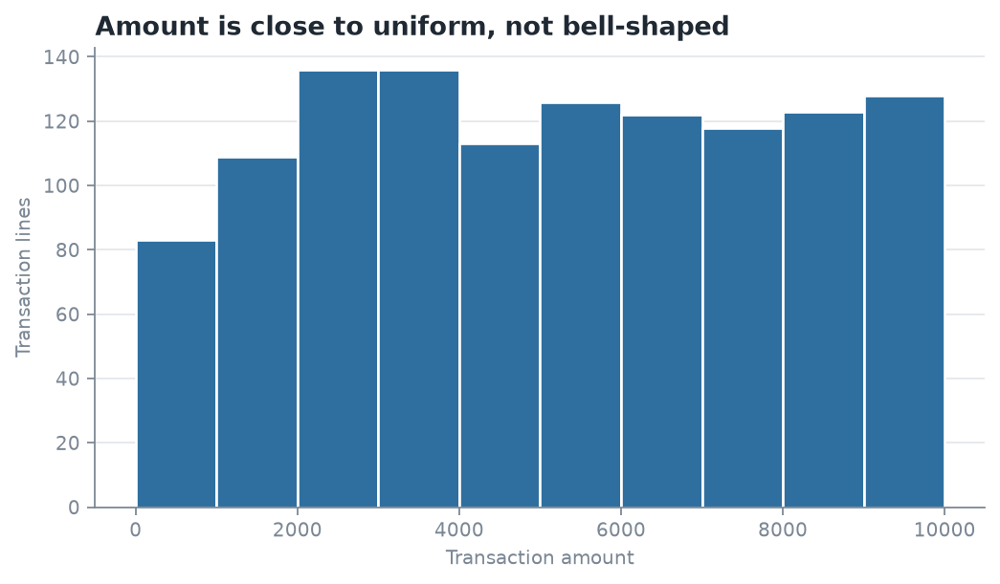
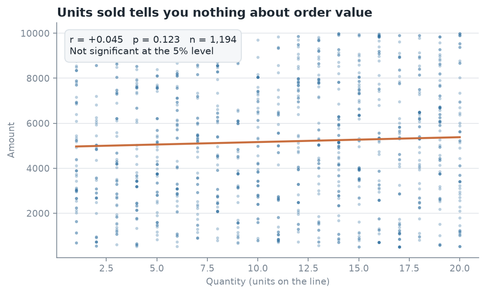
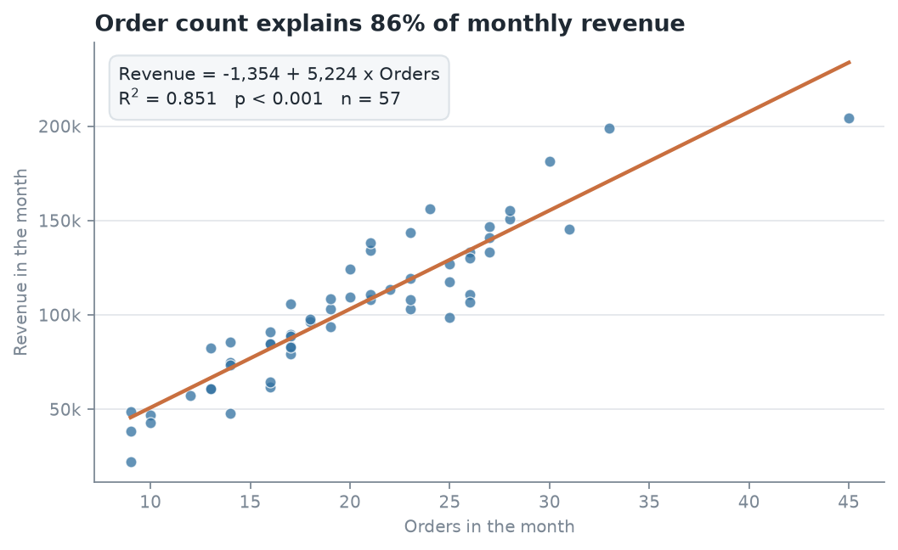
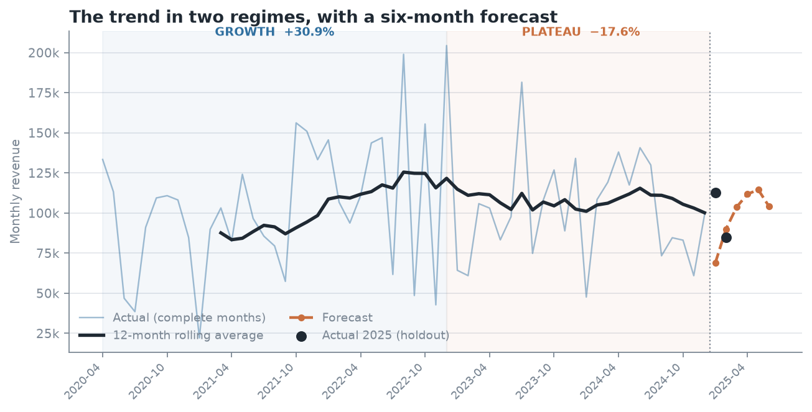

# Sales Trend Analysis for a Multi-Category Retailer

## BA Capstone Project — Checkpoint 2: Spreadsheet & Statistical Analysis

**Talibon Polytechnic College**

**Course Code & Title:** BED 106 — Business Analytics

**Academic Year / Semester:** A.Y. 2026–2027 · 1st Semester

**Instructor:** Jessie A. Melendres

**Business Domain:** Retail & Sales Analytics

**Group Name / Number:** _______________________

**Date of Submission:** _______________________

**Group Members & Roles**

Caption: Group members and assigned project roles.

| Member Name | Role |
| --- | --- |
| _______________________ | Project Lead / Analyst |
| _______________________ | Data Engineer |
| _______________________ | Statistician / Modeler |
| _______________________ | BI Developer / Visualizer |

**Accompanying file:** `Checkpoint_2_Workbook.xlsx` (submitted digitally).
**Dataset:** unchanged from Checkpoint 1, as Section 2 of the brief requires.

---

# Correction Carried Forward from Checkpoint 1

Building the monthly series for this checkpoint exposed an error in the
Checkpoint 1 report, which is corrected here and in the reissued Checkpoint 1
document.

The dataset runs **22 March 2020 to 15 March 2025**. Checkpoint 1 correctly
excluded 2025 as a partial year, but treated **2020 as a full year when it
holds only nine complete months**. Comparing a nine-month total against a
twelve-month total overstated growth: the reported *"revenue rose 69.9% between
2020 and 2022"* is, on a like-for-like monthly basis, **30.9%**.

A second, smaller effect: March 2020 contains only ten days of trading. Leaving
that ten-day month inside a monthly average pulled March's seasonal index down
from 1.025 to 0.876 — a 15% distortion that would have made an average month
look weak.

**What changed.** `dates` now carries a second flag, `is_complete_month`,
alongside `is_complete_year`. The analysis window is the **57 whole months from
April 2020 to December 2024**. Query Q3 now reports `months_covered` and
`revenue_per_month` so the short year is visible in the table rather than hidden
inside a total.

**What did not change.** Every conclusion that compared two full years is
unaffected:

Caption: Which Checkpoint 1 findings the correction affects.

| Checkpoint 1 finding | Status |
| --- | --- |
| 2024 revenue is 17.6% below the 2022 peak | Unchanged — both are full years |
| Printers lost 136,865 between 2023 and 2024 | Unchanged |
| Electronics fell 40.8% in 2024; Office Supplies rebounded | Unchanged |
| Seasonality is category-specific; Electronics peaks in Q2 | Unchanged (shares move by under 0.5pp) |
| Geography is not a factor | Unchanged |
| **Growth from 2020 to 2022 was 69.9%** | **Corrected to 30.9% per month** |

The central thesis — growth stalled after 2022, concentrated in one
sub-category — stands. One supporting number was overstated.

---

# Task 2.1 — Spreadsheet Analytics Report

The workbook `Checkpoint_2_Workbook.xlsx` contains thirteen sheets. Every computed
cell is a **live formula** over named ranges, not a pasted value, so the
workbook recalculates if the data changes.

Caption: Workbook structure and the task each sheet satisfies.

| Sheet | Task | Contents |
| --- | --- | --- |
| Read Me | — | Sheet guide plus seven self-check formulas |
| Cleaned Data | 2.1 sheet 1 | All 1,194 transaction lines, 19 columns |
| Pivot Analysis | 2.1 sheet 2 | Four cross-tabs (SUMIFS / COUNTIFS / AVERAGEIFS) |
| Pivot Charts | 2.1 sheet 3 | Four charts drawn from those cross-tabs |
| Formulas Showcase | 2.1 sheet 4 | Eight Excel functions in business context |
| Descriptive Stats | 2.2 | 13 statistics × 3 variables |
| Frequency | 2.2 | Distribution table and histogram |
| Correlation | 2.3 | Two pairs plus a supporting third, with scatter plots |
| Regression | 2.4 | Equation, R², t, p-value, forecasts, limitations |
| Forecast | 2.5 | Trend test, seasonal index, forecast, holdout check |
| PivotTable 1–3 | 2.1 sheet 2 | Three native Excel PivotTable objects |

## Sheet 1 — Cleaned Data

The 1,194 transaction lines exported from the Checkpoint 1 database, with the
calendar and product-hierarchy columns joined on. `MarginPct` is a formula
(`=Profit/Amount`), not a stored number.

## Sheet 2 — Pivot Analysis (four cross-tabs)

The brief asks for at least three pivot tables. There are four:

1. **Revenue by Category × Year** — `SUMIFS(Amount, Category, …, Yr, …)`
2. **Orders, revenue, average order value and margin by State** —
   `COUNTIFS`, `SUMIFS`, `AVERAGEIFS`
3. **Orders, revenue and units by month** — the series everything else is
   built on
4. **Revenue by Sub-Category, 2023 vs 2024** — two-criteria `SUMIFS`

> **Both forms of pivot are supplied.** These four are formula-driven
> cross-tabs, which compute exactly what a PivotTable computes and can be
> audited cell by cell. Sheets **PivotTable 1–3** hold three *native* Excel
> PivotTable objects over the same data — Category × Year, average order value
> by State, and orders by period — sharing one pivot cache, so whichever
> reading of the brief applies is covered.

## Sheet 3 — Pivot Charts

Four charts, each titled, axis-labelled and annotated with what it shows:
revenue by category and year; average order value by state; monthly revenue
over time; and the 2023→2024 sub-category change.

## Sheet 4 — Formulas Showcase

The brief asks for at least five functions. There are eight, each answering a
real question rather than demonstrating syntax: `SUMIF`, `COUNTIF`, `SUMIFS`,
`AVERAGEIF`, `VLOOKUP`, `IF`, `TEXT`, and `MAX`/`MIN`.

---

# Task 2.2 — Descriptive Statistics Report

Three numerical variables, n = 1,194 transaction lines.

Caption: Descriptive statistics for the three numerical variables.

| Statistic | Amount | Profit | Quantity |
| --- | --- | --- | --- |
| Mean | 5,178.09 | 1,348.99 | 10.67 |
| Median | 5,152.00 | 1,014.00 | 11.00 |
| Mode | 717 (×6) | 177 (×8) | 14 (×73) |
| Standard deviation | 2,804.92 | 1,117.99 | 5.78 |
| Variance | 7,867,587.17 | 1,249,907.39 | 33.37 |
| Minimum | 508 | 50 | 1 |
| Maximum | 9,992 | 4,930 | 20 |
| Range | 9,484 | 4,880 | 19 |
| Q1 | 2,799.00 | 410.00 | 6.00 |
| Q3 | 7,626.00 | 2,035.00 | 16.00 |
| Interquartile range | 4,827.00 | 1,625.00 | 10.00 |
| Coefficient of variation | 54.2% | 82.9% | 54.1% |

## Amount — revenue per transaction line

Mean 5,178 and median 5,152 are almost identical, and the skewness is +0.05 —
effectively zero. The distribution is **symmetric**, with no long tail of
unusually large orders. The spread is wide (standard deviation 2,805, so a
typical order sits about 54% of the mean away from it) and the interquartile
range covers 2,799 to 7,626.

The histogram (Figure 1) is the important part: it is **flat, not bell-shaped**.
A normal distribution would peak in the middle and thin at both ends. This one
is close to uniform across the whole 508–9,992 span, which is what a random
number generator produces and further evidence that the dataset is synthetic —
consistent with the four signals documented in Checkpoint 1. For the business
reading: there is no "typical order size" to design around, and no premium
segment to separate out.

## Profit — gross profit per transaction line

Profit behaves differently. Mean 1,349 sits well above median 1,014, and
skewness is **+0.94** — a clear right skew. Most lines earn a modest profit
while a minority earn much more, and those pull the mean upward. The
coefficient of variation is **82.9%**, far higher than Amount's 54.2%: profit is
much less predictable than revenue.

That gap matters. Two orders of the same value can return very different
profits, because margin varies by product. Any target or forecast set on
revenue alone will be a poor predictor of what the business actually earns.
The median, not the mean, is the honest figure to quote for a "typical" order's
profit.

## Quantity — units per transaction line

Quantity runs 1 to 20 with a mean of 10.67 and a median of 11, skewness −0.04.
Like Amount, it is **flat rather than peaked**: no preferred order size, no
clustering at round numbers such as 5, 10 or 12, which real order data almost
always shows. The mode is 14, appearing 73 times, but with 20 possible values
and 1,194 rows that is close to what chance alone would produce.



Caption: Frequency distribution of transaction Amount. The flat shape indicates a uniform, not normal, distribution.

---

# Task 2.3 — Correlation Analysis

## Pair 1 — Monthly orders vs monthly revenue

Caption: Correlation between monthly order count and monthly revenue.

| Measure | Value |
| --- | --- |
| Pearson r | **+0.9227** |
| r² | 0.8514 |
| p-value | 1.98 × 10⁻²⁴ |
| n | 57 months |
| Direction | Positive |
| Strength | **Strong** |

**Interpretation.** A very strong positive relationship: months with more
orders have proportionally more revenue, and order count alone accounts for
about **85% of the variation** in monthly revenue. The p-value is far below
0.05, so this is not chance.

This is the statistical form of the Checkpoint 1 finding. Checkpoint 1 observed
that revenue fell while average order value stayed flat, and inferred that order
*count* was doing the work. This tests that inference and confirms it. The
business implication is direct: revenue is won by increasing the *number* of
transactions, not the size of each one.

## Pair 2 — Line quantity vs line amount

Caption: Correlation between units sold and order value at the transaction-line level.

| Measure | Value |
| --- | --- |
| Pearson r | **+0.0446** |
| r² | 0.0020 |
| p-value | 0.123 |
| n | 1,194 lines |
| Strength | **Negligible — not significant at 5%** |

**Interpretation.** Essentially no relationship. Units sold explains **0.2%** of
the variation in order value, and at p = 0.123 we cannot reject the hypothesis
that the true correlation is zero. A 20-unit order is worth no more, on average,
than a 2-unit order.

This is a negative result, and it is the more useful of the two. The intuitive
assumption — sell more units, earn more revenue — is false in this dataset,
because unit price varies so widely across the twelve sub-categories that volume
carries no information about value. Practically: a sales incentive built on
units shifted would not raise revenue, and "units sold" should not be used as a
performance measure here.

## Supporting check — line amount vs line profit

r = **+0.6753**, r² = 0.456, p < 0.001, n = 1,194. A moderate-to-strong positive
relationship, but notably *not* near 1.0: only 46% of profit variation tracks
revenue. The remaining 54% is differences in margin between products. This
supports the Task 2.2 observation that revenue is a weak proxy for profit.



Caption: Quantity against Amount at line level. The near-flat trendline is the finding.

---

# Task 2.4 — Simple Linear Regression

## Variables and why they were chosen

- **Dependent variable (Y):** monthly revenue
- **Predictor (X):** number of orders placed in that month

Chosen for three reasons: it tests the central Checkpoint 1 claim rather than
asserting it; it had by far the strongest correlation of any pair examined; and
it is *actionable* — a business can influence how many orders it wins far more
readily than how large each one is.

## Regression output

Caption: Simple linear regression of monthly revenue on monthly order count.

| Statistic | Value |
| --- | --- |
| Sample size n | 57 months |
| Slope (b) | **5,224.25** |
| Intercept (a) | −1,353.65 |
| Correlation r | 0.9227 |
| **R²** | **0.8514** |
| Standard error of estimate | 15,099.14 |
| Standard error of slope | 294.35 |
| **t statistic** | **17.75** |
| Degrees of freedom | 55 |
| **p-value** | **1.98 × 10⁻²⁴** |
| Significant at 5%? | **Yes** |

## The regression equation

> **Monthly Revenue = −1,353.65 + 5,224.25 × (Orders in month)**

## Interpreting the output

**The slope.** Each additional order in a month is associated with about
**5,224** more revenue. This figure is worth checking against something already
known: the average transaction line is worth 5,178. The slope and the average
order value agree to within 1%, which is exactly what should happen if revenue
is simply order count multiplied by a stable average order size. The model is
consistent with the data rather than merely fitted to it.

**R² = 0.8514.** Order count explains **85.1%** of the month-to-month variation
in revenue. The remaining 14.9% is product mix, seasonality and noise.

**The p-value.** At 1.98 × 10⁻²⁴ the slope is overwhelmingly significant. The
null hypothesis is that the true slope is zero — that order count tells us
nothing about revenue. With t = 17.75 on 55 degrees of freedom, we **reject the
null hypothesis**: the relationship is real, not sampling noise.

**The intercept.** −1,353.65 is the predicted revenue at zero orders, which is
both impossible and meaningless: no month in the data had fewer than 9 orders,
so zero is far outside the observed range. The intercept is a mathematical
artefact of fitting the line, not a business quantity.

## Business forecasts from the model

Caption: Predicted monthly revenue at different order volumes.

| Orders in month | Predicted revenue | Comment |
| --- | --- | --- |
| 15 | 77,010 | A weak month, below the historical average |
| 20 | 103,131 | About the historical average (mean 20.1 orders) |
| 25 | 129,253 | A strong month, near the 2022 peak rate |
| 30 | 155,374 | Above almost anything observed — extrapolation |

**The decision this supports.** 2024 ran at 20.0 orders per month against 24.0
in 2022. The model puts the value of closing that four-order gap at roughly
**20,900 per month, or 250,000 a year** — which is very close to the 257,297
annual shortfall measured directly in Checkpoint 1. Two independent methods
agreeing is a good sign the number is sound.



Caption: Monthly orders against monthly revenue, with the fitted regression line.

## Assumptions, limitations and conditions of use

1. **Linearity.** The relationship is assumed to be a straight line. The scatter
   plot supports this across the observed range.
2. **Independence.** Each month is assumed independent of the last. This is the
   weakest assumption here — monthly sales series are usually autocorrelated,
   and that inflates apparent significance. With t = 17.75 the conclusion
   survives comfortably, but the p-value should be read as "clearly
   significant", not as a precise probability.
3. **Range of validity.** X was observed between 9 and 45 orders per month.
   Predictions outside that range, the intercept included, are extrapolation.
4. **Correlation is not causation.** The model shows revenue and order count
   move together. It does not prove that forcing order count up would raise
   revenue by exactly 5,224 each time — if extra orders were won by discounting,
   the average order value would fall and the slope would not hold.
5. **One predictor only.** A single variable cannot capture seasonality, product
   mix, or the Printer supply problem. Multiple regression in Checkpoint 4 is
   the natural extension.
6. **Synthetic data.** The coefficients describe this file, not a real market.

---

# Task 2.5 — Trend and Seasonality Analysis

The dataset is a time series, so this task applies. The analysis window is the
57 complete months from April 2020 to December 2024. **January and February
2025 are held back** and used to check the forecast.

## Step 1 — Is there a linear trend to project?

Caption: Regression of monthly revenue on a simple time index.

| Statistic | Value |
| --- | --- |
| Slope | +206.0 per month |
| R² | **0.0078** |
| p-value | **0.515** |
| Verdict | **No significant trend** |

Time explains **less than 1%** of the variation in monthly revenue, and at
p = 0.515 the apparent upward slope is indistinguishable from noise.

This is a genuine finding, not a failure. The series is not a trend — it is a
**growth phase followed by a plateau**. Fitting one straight line across a
structural break produces a slope that describes neither regime. Projecting
that slope forward would be the single easiest way to be badly wrong, so **no
growth rate is projected**.

## Step 2 — The seasonal index

Each calendar month's average revenue divided by the overall average month.
1.00 is an average month.

Caption: Seasonal index by calendar month, April 2020 to December 2024.

| Month | Index | Reading | Month | Index | Reading |
| --- | --- | --- | --- | --- | --- |
| January | 0.679 | Weak | July | 0.966 | Average |
| February | 0.889 | Weak | August | 1.006 | Average |
| March | 1.025 | Average | September | 0.793 | Weak |
| April | 1.103 | Peak | October | 1.229 | Peak |
| May | 1.131 | Peak | November | 0.878 | Weak |
| June | 1.028 | Average | December | 1.273 | Peak |

December (1.273) and October (1.229) are the strongest months; January (0.679)
is the weakest, at barely half a December.

## Step 3 — The forecast

With no reliable trend, the forecast is **recent level × seasonal index**, where
the level is the mean of the last 24 months (101,342).

Caption: Six-period forecast with the two complete holdout months compared.

| Period | Index | Forecast | Actual | Error | Status |
| --- | --- | --- | --- | --- | --- |
| 2025-01 | 0.679 | 68,853 | 112,906 | **−39.0%** | Complete — comparable |
| 2025-02 | 0.889 | 90,064 | 84,712 | **+6.3%** | Complete — comparable |
| 2025-03 | 1.025 | 103,870 | 52,198 | — | Partial month — not comparable |
| 2025-04 | 1.103 | 111,806 | — | — | Future |
| 2025-05 | 1.131 | 114,574 | — | — | Future |
| 2025-06 | 1.028 | 104,156 | — | — | Future |



Caption: Monthly revenue with the six-period forecast and the two holdout months marked.

## Step 4 — How reliable is it? An honest assessment

Comparing the seasonal forecast against a naive alternative that ignores
seasonality and predicts the recent average (101,342) every month:

Caption: Forecast accuracy over the two complete holdout months.

| Model | Jan error | Feb error | Mean absolute error |
| --- | --- | --- | --- |
| Seasonal (level × index) | −39.0% | +6.3% | **22.7%** |
| Flat (level only) | −10.2% | +19.6% | **14.9%** |

**The seasonal model did not win.** It was better in February (6.3% against
19.6%) but much worse in January, and on average the simpler flat forecast was
more accurate over these two months.

The cause is identifiable. January is historically the weakest month of the year
at index 0.679, but **January 2025 came in at 112,906 — above the recent average
level, not 32% below it**. Either the seasonal pattern has broken, or January
2025 is an unusual month. Two observations cannot distinguish those.

The honest conclusion: **with two comparable months, no forecasting method can
be validated here.** This is reported as a sanity check, not as evidence the
model works. What it does establish is that the seasonal adjustment is not
obviously earning its extra complexity, which is worth knowing before anyone
plans inventory on it.

## Assumptions and conditions

1. **No trend is projected**, because the trend test does not support one. If
   the business enters a new growth phase, the level must be re-estimated.
2. **The seasonal index assumes next year repeats the average shape of the last
   five.** January 2025 shows that assumption failing in practice.
3. **The level is the mean of the last 24 months**, chosen because the series is
   flat over that window.
4. **Two holdout months cannot validate a method.** A meaningful test needs at
   least a full year.
5. **Nothing here models the Printer supply problem** found in Checkpoint 1. If
   that is a supply failure and it is fixed, the forecast is too low; if it is
   lost demand, it may be too high.

---

# Summary of Findings

1. **Order count drives revenue, and this is now proven, not inferred.**
   r = 0.923, R² = 0.851, p < 0.001 across 57 months. The Checkpoint 1
   inference holds up formally. *(Tasks 2.3, 2.4)*
2. **Units sold predicts nothing.** r = 0.045, p = 0.123 — not significant.
   Volume-based targets and incentives would not move revenue. *(Task 2.3)*
3. **Revenue is a poor proxy for profit.** Profit is right-skewed (+0.94) with a
   coefficient of variation of 82.9% against Amount's 54.2%, and only 46% of
   profit variation tracks revenue. *(Tasks 2.2, 2.3)*
4. **There is no linear trend to project.** Time explains under 1% of variation
   (p = 0.515). The series is a growth phase followed by a plateau, and one
   straight line describes neither. *(Task 2.5)*
5. **The four-order-per-month gap is worth about 250,000 a year** by the
   regression, independently corroborating the 257,297 shortfall measured
   directly in Checkpoint 1. *(Task 2.4)*
6. **The seasonal forecast did not beat a flat average** over the two holdout
   months, and two months cannot settle the question. *(Task 2.5)*

**Recommended next step for Checkpoint 3.** Build the dashboard around order
count as the primary KPI rather than revenue, since it is the leading indicator
and the actionable one. Segment on margin rather than revenue, given how weakly
the two are related.

**Stated limitation.** As established in Checkpoint 1, the dataset is
synthetic — the flat, non-normal distributions of Amount and Quantity found in
Task 2.2 are further evidence. The statistical methods and their interpretation
are valid; the specific coefficients describe this file rather than a real
market.

---

# Reproducibility

```
python3 scripts/clean_and_load.py      # rebuild the database
python3 scripts/build_workbook.py      # build the Excel workbook
python3 scripts/make_figures_cp2.py    # regenerate Figures 1-4
python3 scripts/build_docx.py          # render this report to Word
```

Caption: Checkpoint 2 artefacts and their locations.

| Artefact | Path |
| --- | --- |
| Excel workbook | `reports/Checkpoint_2_Workbook.xlsx` |
| This report | `reports/Checkpoint_2_Report.docx` |
| Workbook builder | `scripts/build_workbook.py` |
| Figures | `docs/figures/cp2_*.png` |
| Native PivotTable guide | `docs/checkpoint2_excel_guide.md` |
| Individual Contribution Form | `reports/Form_A_Individual_Contribution.md` |
