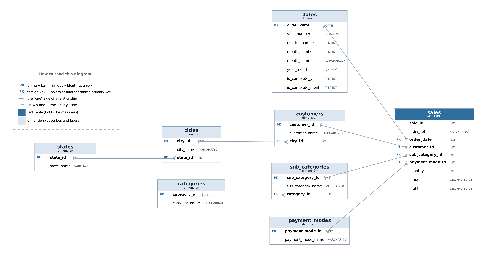
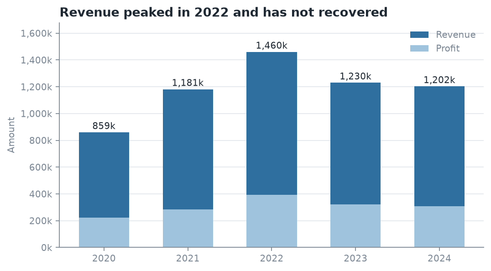
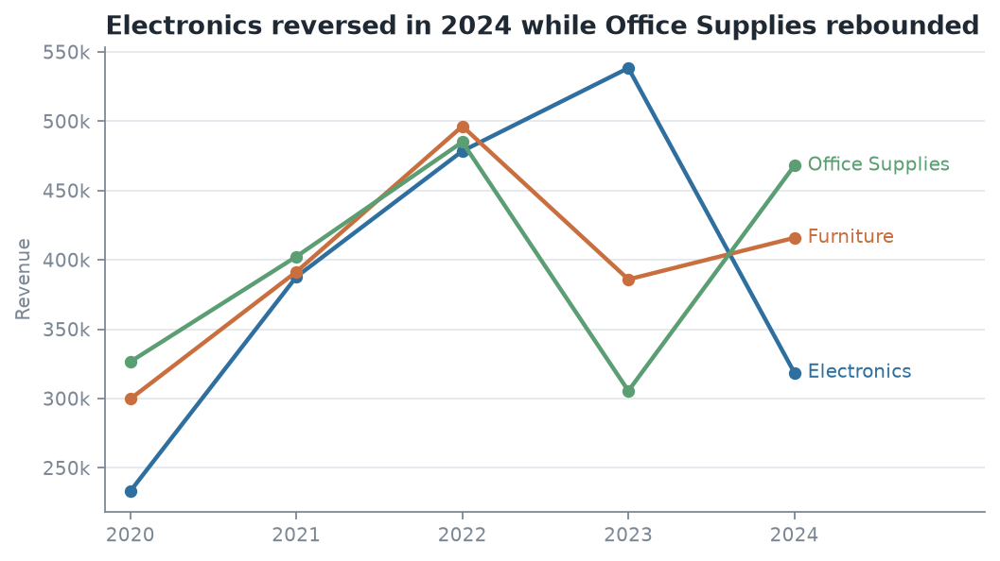
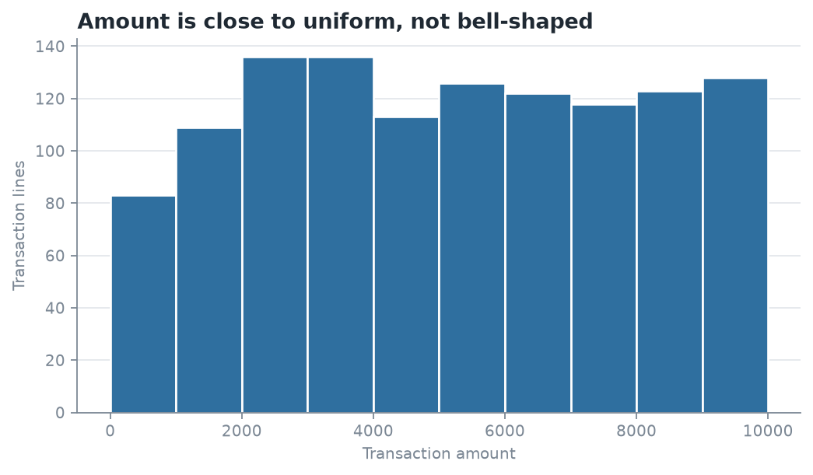
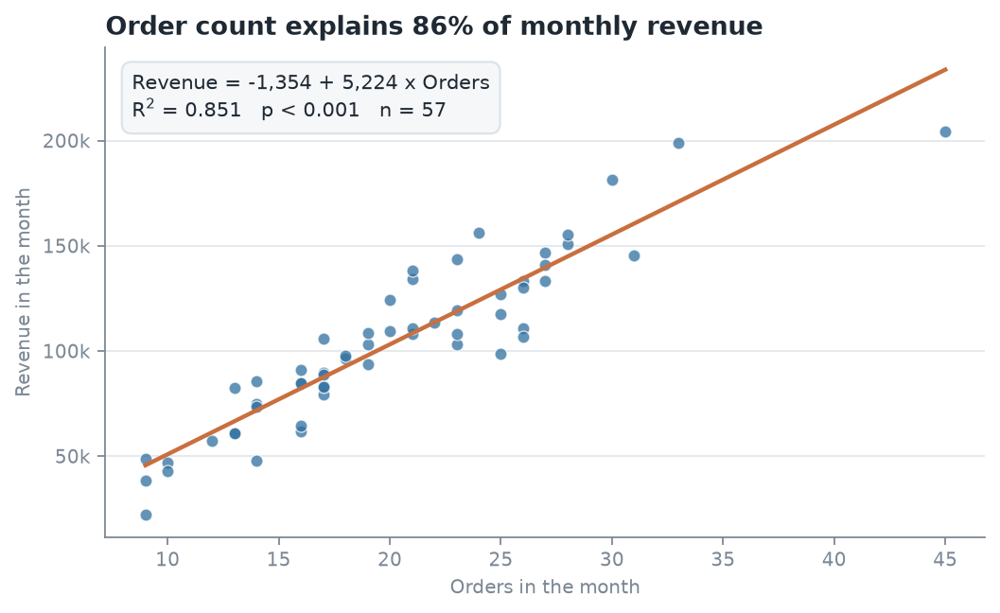
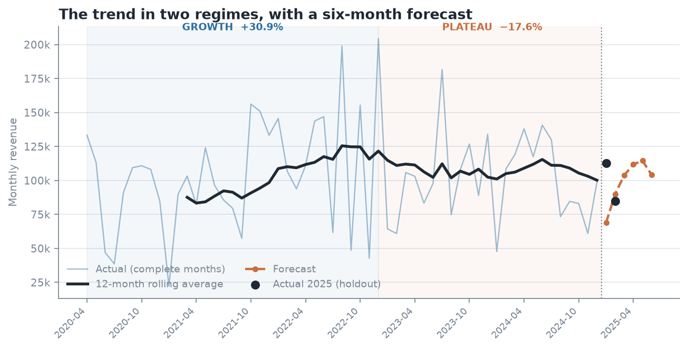
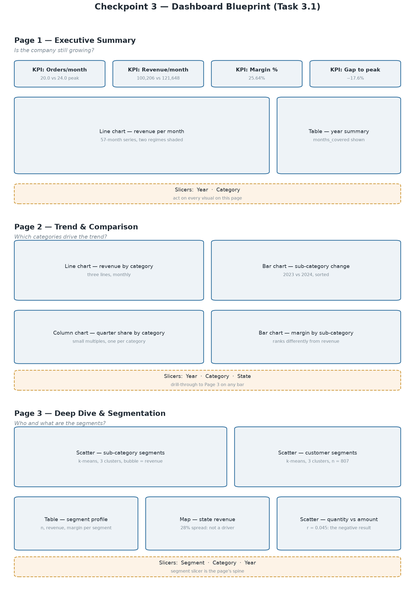
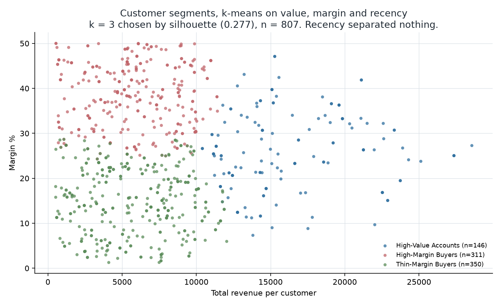
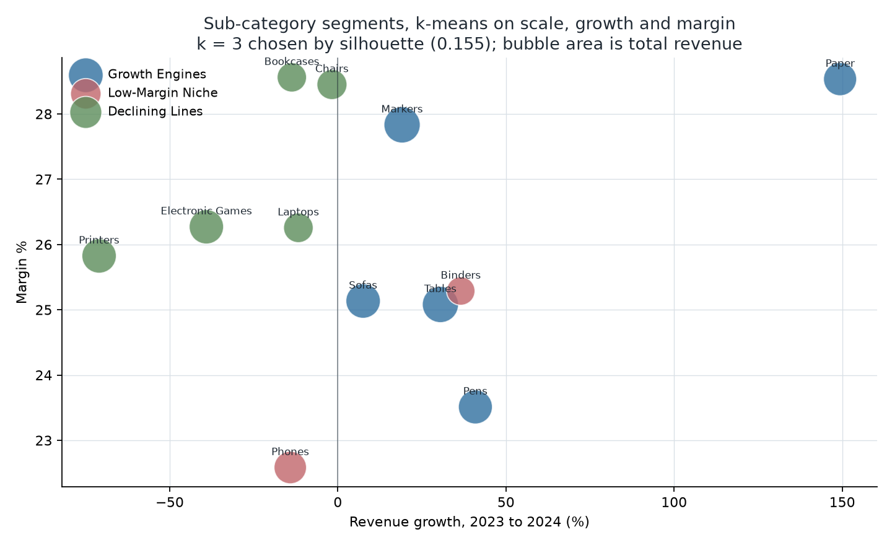
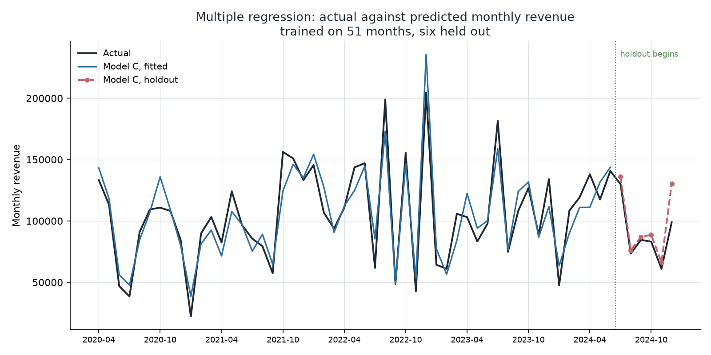

# Sales Trend Analysis

## Why a growing retailer stopped growing, and what the data says to do about it

**Integrated Capstone Report**

BED 106 — Business Analytics · Mini Capstone Project
Talibon Polytechnic College
A.Y. 2026–2027, 1st Semester

Caption: Group members and assigned project roles.

| Member | Role | Signature |
| --- | --- | --- |
| Alber | | |
| Julebeth | | |
| Mardy | | |

| | |
| --- | --- |
| **Group Name / Number** | _______________________ |
| **Course Code and Title** | BED 106 — Business Analytics |
| **Project Title** | Sales Trend Analysis: diagnosing a growth plateau in a multi-category retailer |
| **Instructor** | Jessie A. Melendres |
| **Submission Date** | _______________________ |
| **Academic Year** | 2026–2027, 1st Semester |

---

# 2. Executive Summary

This project analyses five years of transaction data from a multi-category
retailer — electronics, furniture and office supplies — trading across six US
states between March 2020 and March 2025. The business question is narrow and
specific: **the company grew, then stopped, and nobody could say why.**

On a like-for-like monthly basis revenue rose **30.9%** from 2020 to a peak in
2022, then fell in each of the next two years to finish 2024 **17.6% below**
that peak. What makes this an analytical problem rather than an obvious one is
what did *not* move. Margin held between 23.97% and 26.93% across the whole
period, and average order value stayed between 5,008 and 5,444. Had margin
collapsed, the answer would be that the company discounted too hard. It did
not. The company is writing **fewer orders, not worse ones** — and a single
annual revenue figure cannot say which orders went missing, when, or where.

**Methods.** We built a normalised database and interrogated it with SQL
(Checkpoint 1), took the same data into Excel for descriptive statistics,
correlation and regression (Checkpoint 2), built an interactive Power BI
dashboard and applied k-means segmentation (Checkpoint 3), then extended the
regression into a multiple-predictor model and evaluated it against held-out
data (Checkpoint 4).

**Four findings carry the report.**

**The decline is concentrated, not general.** Printers alone lost **136,865**
between 2023 and 2024 — a 71.0% collapse, and more than half the entire gap
between the 2022 peak and 2024. Every Electronics sub-category fell; every
Office Supplies sub-category grew, led by Paper at +149.4%. Two opposite trends
run at once, and the company-wide figure is their average, which describes
neither.

**Order count is the only measurable driver of revenue.** It explains 85% of
month-to-month variation (r = 0.9227, R² = 0.8514, p = 1.98 × 10⁻²⁴). When
units sold, customer count, product mix and elapsed time were each given a fair
chance alongside it in a multiple regression, **none of them explained
anything**. Closing the four-order-per-month gap against 2022 is worth roughly
**250,000 a year** — a figure Checkpoint 1 reached independently, at 257,297,
by summing category shortfalls.

**Seasonality is category-specific.** Electronics peaks in Q2 at 30.79% of its
own annual revenue while Furniture and Office Supplies peak in Q4. The single
blended planning curve the business uses is wrong for all three.

**Revenue is a poor proxy for profit, and the customer base proves it.**
Clustering 807 customers produced three segments. The largest — 43% of
customers and a third of revenue — returns just **19% of the profit**, while a
smaller, higher-margin group turns less revenue into **43%** of it. A sales
effort aimed at revenue would chase the wrong group.

**Recommendations.** Track order count rather than revenue as the primary KPI;
investigate Printers first; plan seasonality by category; segment on margin
rather than revenue; and stop setting volume or acquisition targets, which the
data shows do not move revenue.

**Limitations, stated plainly.** The dataset is **synthetic** — generated, not
collected — which we established with five independent machine-checked signals
rather than discovering late. The figures therefore illustrate a method rather
than describe a real company, though every query, statistic and model here
would run identically against a real export. Our six-month forecast was tested
against held-out months and **lost to a naive flat average**, 22.7% mean
absolute error against 14.9%; we report that rather than drop the test. And
correlation is not causation: order count and revenue move together, which is
not proof that one causes the other.

---

# 3. Business Problem and Data Source

## 3.1 The business and the problem

The subject is a multi-category retailer selling electronics, furniture and
office supplies across six US states — Illinois, California, Texas, Florida,
New York and Washington — through 18 cities. Retail and Sales Analytics is an
approved domain under Section 1.3 of the project brief, and sales trend
analysis is listed under it.

The company grew to a revenue peak in 2022 and has declined since. The
decisions hanging on an explanation are concrete: what to stock, when to stock
it, and where to direct sales effort. Getting them wrong costs inventory that
does not sell and campaigns that land in the wrong quarter.

## 3.2 The three business questions

Caption: The three business questions and the analysis that answers each.

| # | Question | Answered by |
| --- | --- | --- |
| 1 | How have revenue and profit trended, and is the company still growing? | Query 3; Checkpoint 2 regression; Section 7 |
| 2 | Which categories and sub-categories drive the trend? | Queries 5 and 7; Section 6 segmentation |
| 3 | When does demand concentrate, and is the pattern the same for every category? | Queries 4 and 8 |

Every deliverable in this project maps back to one of these three.

## 3.3 Data source

Historical point-of-sale transaction records, one row per product line on an
order, obtained as a public CSV export in the Kaggle "Sales Dataset" format.

Caption: Data source report for the sales transaction dataset.

| Attribute | Details |
| --- | --- |
| Dataset Name | Sales Dataset (multi-category US retail transactions) |
| Source File | `archive.zip → Sales Dataset.csv`; stored unmodified as `data/raw/sales_dataset_raw.csv` |
| Date Accessed | 24 August 2026 |
| Licence | Public/open dataset, used for academic coursework only |
| Size | 1,194 data rows × 12 columns |
| Coverage | 22 March 2020 – 15 March 2025 |
| Currency | Not stated in the source. `Amount` and `Profit` are unitless integers; all figures are quoted as currency units |

## 3.4 The dataset is synthetic

This is stated here, early, because every figure in the report depends on it.

The file is generated data, not collected trading data. Five independent
signals, each checked by machine rather than by eye:

- **No loss-making line in five years.** All 1,194 rows return a positive
  profit. No real retailer has that
- **22 of the 802 customer names end in credential suffixes** such as "MD",
  "PhD" or "DDS" — a known artefact of the Faker synthetic-data library
- **US cities paired with UPI and EMI payment methods.** Those are Indian
  payment rails; they do not occur in US retail
- **A near-uniform payment mix** — between 206 and 260 transactions for every
  one of the five methods, where real data shows strong preference
- **A flat transaction-amount distribution.** Our own Checkpoint 2 histogram
  confirms it independently: no bin holds more than 11.4% or less than 7.0% of
  rows, where real transaction values are strongly right-skewed

**We corrected none of it.** Fabricating plausible-looking repairs would have
been data fabrication, which Section 3.2 of the brief makes grounds for a
failing mark. We documented each defect and worked around it. The consequence
is that the *figures* in this report illustrate a method; the *method* is
unaffected and transfers to real data without modification.

---

# 4. Database Design and SQL Analysis

## 4.1 Data quality assessment

The raw file was assessed before anything was changed. Five problems, in order
of the trouble they caused.

**One — `Order ID` is not a primary key.** 1,194 rows carry only 547 distinct
order identifiers, and the duplicates are not duplicate rows: the same ID
appears on different dates, for different customers. It identifies neither a
row nor an order. Repairing it would have meant deciding which of two
conflicting rows was real with no evidence for the decision, so it was kept as
a plain attribute and a surrogate key, `sale_id`, issued instead. No question in
this project requires order identity.

**Two — `CustomerName` is not an identifier either.** 807 customers resolve
from 802 distinct names, because five names appear in more than one city. The
customer key is therefore the pair (name, city). This defect recurred in
Checkpoint 3: building the Power BI model on the name rather than the key would
have silently merged those five pairs.

**Three — `Year-Month` is redundant**, being fully derivable from `Order Date`,
and was dropped from the schema and rebuilt in the `dates` dimension.

**Four — both ends of the file are partial.** It begins 22 March 2020 and ends
15 March 2025, so neither 2020 nor 2025 is a whole year. This is the defect
that caused the single real error in this project; Section 4.5 records it.

**Five — the dataset is synthetic**, as documented in Section 3.4.

No missing values were found in any of the twelve columns, and all three
measures are internally consistent.

## 4.2 Database design

The flat file was normalised into a **star schema**: one fact table surrounded
by seven dimensions.

Caption: Entity-Relationship Diagram of the sales_trend database. PK marks a primary key, FK a foreign key.

`sales` is the fact table at a grain of one transaction line. Around it sit
`customers`, `cities`, `states`, `categories`, `sub_categories`,
`payment_modes` and `dates`.

**Why a star rather than the single table we started with?** Three reasons.
*Consistency*: in the flat file a category name repeats on every row that uses
it, so one typo creates a category that does not exist; in the star it lives
once and the fact table carries an integer key, making the typo impossible
rather than merely unlikely. *The brief*: Task 1.3 requires at least two
related tables with proper keys. *The queries*: the category trend question
needs category and date on the same row as the amount, which a star delivers in
one join.

The `dates` dimension carries two flags the raw dates cannot —
`is_complete_month` and `is_complete_year` — which are the structural fix for
problem four. It also keeps the SQL portable: no `YEAR()` or `strftime()` is
called anywhere, so the same query file runs unchanged on MySQL 8 and SQLite 3,
and both were verified.

Caption: Populated row counts verified after load.

| Table | Rows |
| --- | --- |
| `states` | 6 |
| `cities` | 18 |
| `categories` | 3 |
| `sub_categories` | 12 |
| `payment_modes` | 5 |
| `customers` | 807 |
| `dates` | 648 |
| `sales` | 1,194 |

The schema creates **8 primary keys, 7 foreign keys, 6 unique constraints and 4
check constraints**, all verified on a live MySQL-compatible server. Both
foreign keys and check constraints were tested to confirm they reject invalid
rows rather than assumed to. `sales` holds exactly the 1,194 rows of the raw
file: nothing was lost or invented in normalisation.

One implementation note worth recording: **`year_month` is a reserved word in
MySQL**, and `CREATE TABLE dates` failed outright with a syntax error until it
was backticked. This surfaced only because a real MySQL server was installed
and the import actually run, rather than the file being assumed correct.

## 4.3 SQL query results

Eight queries in four groups: two basic retrievals using `WHERE` and
`ORDER BY`, two aggregates using `GROUP BY`, two multi-table joins of four
tables each, and two business-insight queries. Full SQL is in `sql/04_queries.sql`
and every result table appears in the Checkpoint 1 report; the four findings
are summarised here.

**Finding 1 — growth stopped in 2022, in a specific way.**

Caption: Q3 — annual sales trend, measured per month so the nine-month 2020 compares fairly.

| Year | Months | Lines | Revenue | Revenue/month | Avg line | Margin % |
| --- | --- | --- | --- | --- | --- | --- |
| 2020 | 9 | 167 | 836,410 | 92,934.44 | 5,008.44 | 26.05 |
| 2021 | 12 | 217 | 1,181,446 | 98,453.83 | 5,444.45 | 23.97 |
| 2022 | 12 | 288 | 1,459,775 | **121,647.92** | 5,068.66 | 26.93 |
| 2023 | 12 | 234 | 1,229,723 | 102,476.92 | 5,255.23 | 26.16 |
| 2024 | 12 | 240 | 1,202,478 | 100,206.50 | 5,010.33 | 25.64 |

Margin never leaves the 24–27% band and average line value never leaves
5,008–5,444, while revenue per month falls 17.6% from the peak. That
combination is the diagnosis: fewer orders, not cheaper or less profitable
ones, which points at demand generation rather than pricing.

**Finding 2 — one sub-category explains most of the gap.**

Caption: Q7 — sub-category revenue change, 2023 against 2024.

| Category | Sub-category | 2023 | 2024 | Change | % |
| --- | --- | --- | --- | --- | --- |
| Electronics | Printers | 192,817 | 55,952 | **−136,865** | **−71.0** |
| Electronics | Electronic Games | 144,484 | 88,017 | −56,467 | −39.1 |
| Electronics | Phones | 115,909 | 99,526 | −16,383 | −14.1 |
| Furniture | Bookcases | 86,730 | 74,875 | −11,855 | −13.7 |
| Electronics | Laptops | 85,109 | 75,135 | −9,974 | −11.7 |
| Furniture | Chairs | 87,711 | 86,185 | −1,526 | −1.7 |
| Furniture | Sofas | 92,052 | 98,984 | +6,932 | +7.5 |
| Office Supplies | Markers | 100,742 | 120,002 | +19,260 | +19.1 |
| Office Supplies | Binders | 64,442 | 88,011 | +23,569 | +36.6 |
| Office Supplies | Pens | 82,959 | 116,900 | +33,941 | +40.9 |
| Furniture | Tables | 119,400 | 155,834 | +36,434 | +30.5 |
| Office Supplies | Paper | 57,368 | 143,057 | **+85,689** | **+149.4** |

Printers alone account for more than half the entire peak-to-2024 gap of
257,297. Electronics as a category is down 40.8%; every Office Supplies line
grew. This is the most useful single thing Checkpoint 1 produced, and it is
invisible at company level.

**Finding 3 — seasonality is category-specific.**

Caption: Q8 — each quarter's share of its own category's annual revenue.

| Category | Q1 | Q2 | Q3 | Q4 |
| --- | --- | --- | --- | --- |
| Electronics | 20.28% | **30.79%** | 23.69% | 25.24% |
| Furniture | 16.96% | 29.46% | 22.74% | **30.84%** |
| Office Supplies | 17.01% | 25.00% | 25.83% | **32.16%** |

The blended company figure says Q4. Split by category, Electronics actually
peaks in Q2. A single planning curve over-stocks Electronics in Q4 and
under-stocks it in Q2 — mistiming roughly a third of the business.

**Finding 4 — geography is not a factor.** Across five years, state revenue
spans only 28% between highest and lowest, with no state trending against the
others (Q6). Not every finding is a discovery; this one tells the business
where *not* to spend analytical effort, and it is reported for that reason.

## 4.4 Figures

Caption: The sales trend in two regimes, measured per month: growth of 30.9% to the 2022 peak, then a 17.6% fall to a plateau.

Caption: Revenue by product category per year. Electronics reversed in 2024 while Office Supplies rebounded.

## 4.5 A correction we made to our own work

Building the Checkpoint 2 monthly series exposed an error in Checkpoint 1.
**2020 was treated as a full year.** The file begins on 22 March, so 2020 holds
only nine months of trading. Comparing its part-year total against a full 2021
overstated 2020-to-2022 growth as **69.9%** when the like-for-like figure is
**30.9%**. It also distorted March's seasonal index, from 1.025 down to 0.876.

Caption: Which Checkpoint 1 findings the correction affects.

| Affected | Unaffected |
| --- | --- |
| The 2020→2022 growth figure | The −17.6% peak-to-2024 decline — both are full years |
| March's seasonal index | Printers −136,865; Electronics −40.8% |
| | Category-specific seasonality; the geography finding |

The central thesis is unchanged; one supporting number was overstated.
Checkpoint 1 was reissued with the `is_complete_month` flag and a per-month
column in Query 3, so the mistake is now structurally prevented rather than
merely fixed. Every per-month measure built since — in Excel, in Power BI and
in the predictive model — divides by months actually covered, never by twelve.

---

# 5. Statistical Analysis

Computed in Excel against the same database extract, with all working visible
as live formulas rather than pasted values. Full detail in the Checkpoint 2
report; the results are summarised here.

## 5.1 Descriptive statistics

Caption: Descriptive statistics for the three numerical variables, n = 1,194.

| Statistic | Amount | Profit | Quantity |
| --- | --- | --- | --- |
| Mean | 5,178.09 | 1,348.99 | 10.67 |
| Median | 5,152.00 | 1,014.00 | 11.00 |
| Standard deviation | 2,804.92 | 1,117.99 | 5.78 |
| Minimum | 508 | 50 | 1 |
| Maximum | 9,992 | 4,930 | 20 |
| Interquartile range | 4,827.00 | 1,625.00 | 10.00 |
| Coefficient of variation | 54.2% | **82.9%** | 54.1% |

**Profit is far less predictable than revenue.** Its coefficient of variation
is 82.9% against Amount's 54.2%, with a skew of +0.94 — more variable *and*
asymmetric, with a long right tail of a few very profitable lines. The
practical consequence is that a revenue target does not manage profit: the two
do not move together tightly enough for one to stand in for the other. This
observation recurs in the regression (Section 5.3) and again in the customer
segmentation (Section 6.3).

Caption: Frequency distribution of transaction Amount. The flat shape indicates a uniform, not normal, distribution.

The histogram is itself a finding. No bin holds more than 11.4% of rows and
none less than 7.0%. A normal distribution concentrates around the mean and
thins at the tails; this is close to flat, which is what a random number
generator produces — independent confirmation of Section 3.4.

## 5.2 Correlation

Caption: The two required correlation pairs.

| Measure | Monthly orders vs revenue | Line quantity vs amount |
| --- | --- | --- |
| Pearson r | **+0.9227** | **+0.0446** |
| r² | 0.8514 | 0.0020 |
| p-value | 1.98 × 10⁻²⁴ | 0.123 |
| n | 57 months | 1,194 lines |
| Strength | **Strong** | **Negligible — not significant at 5%** |

The first pair converts a Checkpoint 1 inference into a measurement: revenue
falls because order count falls, and order count accounts for about 85% of
monthly variation.

The second is a **negative result we are keeping**, because it kills an obvious
strategy. Quantity and order value are unrelated and the relationship is not
statistically significant, so a "sell more units" target would not move revenue
in this business. Price per line varies far more than units per line.

A supporting third pair, amount against profit, gives r = 0.6753 — about 46% of
profit variation tracking revenue. Moderate, not strong, and the same
conclusion as the coefficients of variation reached by a different route.

**Correlation is not causation.** Order count and revenue could both respond to
demand we cannot observe. What the data supports is that the association is
strong and consistent across 57 months.

## 5.3 Simple linear regression

Monthly revenue regressed on monthly order count across the 57 complete months
from April 2020 to December 2024.

> **Monthly Revenue = −1,353.65 + 5,224.25 × (Orders in month)**

Caption: Simple linear regression of monthly revenue on monthly order count.

| Statistic | Value |
| --- | --- |
| Sample size n | 57 months |
| Slope (b) | **5,224.25** |
| Intercept (a) | −1,353.65 |
| **R²** | **0.8514** |
| **t statistic** | **17.75** |
| Degrees of freedom | 55 |
| **p-value** | **1.98 × 10⁻²⁴** |

**The slope is the check that makes this convincing.** One additional order in
a month is associated with about 5,224 more revenue. The plain mean order value
in the data is **5,178.09** — the regression rediscovered it to within 0.9%
without being told what it was.

**The intercept is not meaningful.** Zero orders cannot produce negative
revenue; it is where the fitted line crosses the axis, extrapolated far outside
the observed data, and it is not interpreted.

**The business forecast.** The company runs about four orders per month below
its 2022 level. At 5,224 per order, closing that gap is worth roughly
**250,000 a year**. Checkpoint 1 reached **257,297** by an entirely different
route — summing actual category shortfalls. Two independent methods agreeing
within 3% is the strongest single piece of evidence in this project.

Caption: Monthly orders against monthly revenue, with the fitted regression line.

## 5.4 Trend and seasonality

**The trend is real, and it runs in two regimes.** Growth from 2020 to 2022,
92,934 to 121,648 per month (+30.9%); then a plateau from 2022 to 2024, down to
100,207 (−17.6%).

A straight line fitted across all 57 months explains **under 1% of the
variation — R² = 0.0078, p = 0.515** — and the same result holds across four
different windows. That is *not* "no trend". It is that **no single straight
line fits both regimes**: the up-slope and the flat cancel out, and their
average is nearly horizontal. Projecting a growth rate we tested for and did
not find would be inventing a number, so the forecast is built from level and
seasonality instead.

Caption: Seasonal index by calendar month, April 2020 to December 2024.

| Month | Index | Month | Index |
| --- | --- | --- | --- |
| January | 0.679 | July | 0.966 |
| February | 0.889 | August | 1.006 |
| March | 1.025 | September | 0.793 |
| April | 1.103 | October | 1.229 |
| May | 1.131 | November | 0.878 |
| June | 1.028 | December | 1.273 |

**The forecast was tested, and it lost.** Holding out the two months that could
be verified and comparing against a naive flat average:

Caption: Forecast accuracy over the two complete holdout months.

| Model | Jan error | Feb error | Mean absolute error |
| --- | --- | --- | --- |
| Seasonal (level × index) | −39.0% | +6.3% | **22.7%** |
| Flat (level only) | −10.2% | +19.6% | **14.9%** |

The seasonal model ranks fifth of the eight methods tested. The reason is
visible: January 2025 came in at 112,906 against a prediction of 68,853 —
January's index says it is the weakest month of the year, and this January was
not. We keep the method and report the loss, because choosing a model on the
strength of two observations is overfitting the holdout. The honest statement
is that forecast reliability over this horizon is weak, and we measured our own
error rather than asserting confidence.

Caption: The sales trend in two regimes, with the six-month forecast and the two holdout months at the right.

---
# 6. BI Dashboard Summary

An interactive three-page dashboard built in Power BI Desktop on the same
database, reading five purpose-built SQL views rather than the raw tables.

## 6.1 Design decisions

Three decisions shaped the dashboard, and each one came out of the earlier
analysis rather than out of preference.

**Order count is the primary KPI, not revenue.** Section 5.2 established that
order count explains 85% of revenue variation and Section 7 confirms it is the
only predictor that survives a multiple regression. Revenue is the lagging
indicator; order count is the leading one, and it is the thing the business can
act on. The four KPI cards on Page 1 lead with orders per month.

**Segmentation is by margin, not revenue.** Only about 46% of profit variation
tracks revenue, and profit is far more variable than revenue (CV 82.9% against
54.2%). A dashboard ranking anything by revenue alone points management at the
wrong accounts — Query 1 found lines returning 414 and 4,339 profit on
near-identical revenue.

**No single blended seasonality curve appears anywhere.** Electronics peaks in
Q2 and the other two categories in Q4, so one curve is wrong for all three.
Page 2 shows quarterly revenue as small multiples, one panel per category.

## 6.2 Page structure

Caption: Dashboard pages, the question each answers, and its visuals.

| Page | Question it answers | Visuals |
| --- | --- | --- |
| 1 — Executive Summary | Is the company still growing, and by how much has it slipped? | Four KPI cards; revenue-per-month line with the 2022 peak marked; year summary table |
| 2 — Trend & Comparison | Which categories and sub-categories drive the trend? | Category line chart; sub-category change bars; quarterly small multiples; margin bars |
| 3 — Deep Dive & Segmentation | Who are the customers and what are the product segments? | Two cluster scatters; segment profile table; state map; quantity-against-amount scatter |

**Interactivity.** Slicers on three dimensions — period, category and
geography — act on every page, with a segment slicer added on Page 3.
Drill-through from any sub-category bar on Page 2 opens Page 3 filtered to it.
Cross-filtering between visuals is active throughout.

Caption: Dashboard blueprint — the three pages, their visuals, and the slicers acting on each.

## 6.3 Segmentation findings

Two k-means segmentations, both reproducible from a fixed seed. **k was chosen
by silhouette score**, evaluated across k = 2 to 6 and selected within the two
to three the brief requires.

This choice is worth defending rather than glossing: on the customer data k = 5
scores 0.295 against k = 3's 0.277. We took k = 3 because the difference is too
small to buy back the interpretability of five segments, two of which came out
with the same profile — and because on twelve sub-categories, k = 6 leaves two
members per cluster, which is a partition rather than a segmentation.

**Customer segments — 807 customers**, clustered on value, margin and recency.

Caption: Customer segments, with each segment's share of customers, revenue and profit.

| Segment | n | % of customers | % of revenue | % of profit | Margin |
| --- | --- | --- | --- | --- | --- |
| High-Value Accounts | 146 | 18.1% | 38.4% | 38.7% | 26.2% |
| High-Margin Buyers | 311 | 38.5% | 28.9% | **42.6%** | 38.5% |
| Thin-Margin Buyers | 350 | 43.4% | 32.7% | **18.7%** | 14.9% |

**This is the central finding of the dashboard.** Thin-Margin Buyers are the
largest group — 43% of customers and a third of revenue — and they return 19%
of the profit. High-Margin Buyers produce 43% of profit from *less* revenue. A
sales effort aimed at revenue would chase the wrong group of the two. This is
the customer-level form of the Section 5.1 finding, converted from a statistic
into a list of named accounts.

Two honest notes. **Recency separated nothing** — every cluster centre sits
within 0.11 standard deviations of the mean on it — so there are no "lapsed" or
"active" segments to claim. And purchase frequency spans only one to four lines
(510 of 807 customers bought once), too little spread to carry a segment
boundary, which is why it was not clustered on. Both are consequences of the
synthetic dataset.

Caption: Customer segments. Value separates one cluster; margin separates the other two.

**Sub-category segments — 12 sub-categories**, clustered on scale, growth and
margin.

Caption: Sub-category segments and their movement between 2023 and 2024.

| Segment | Members | 2023 → 2024 |
| --- | --- | --- |
| Growth Engines | Markers, Paper, Pens, Sofas, Tables | 452,521 → 634,777, **+40.3%** |
| Low-Margin Niche | Binders, Phones | 180,351 → 187,537, +4.0% |
| Declining Lines | Bookcases, Chairs, Electronic Games, Laptops, Printers | 596,851 → 380,164, **−36.3%** |

The segmentation recovers Checkpoint 1's central finding without being told it:
the two large clusters move in opposite directions, +40.3% against −36.3%, and
the company-wide figure is their average. The middle cluster is named for
margin rather than growth, because its two members moved in opposite directions
(Binders +36.6%, Phones −14.1%); what they share is low margin and small scale.

Caption: Sub-category segments. Growth separates the two ends; the middle cluster is defined by margin.

## 6.4 Dashboard screenshots

> **TO BE INSERTED.** Paste screenshots of all three dashboard pages here, each
> numbered and captioned, with one or two sentences of your own commentary
> under each. The exported PDF of all three pages is a separate submission
> item. Build instructions are in `docs/PowerBI_Build_Guide.docx`.

---

# 7. Predictive Analytics

Extending the Checkpoint 2 regression into a multiple-predictor model, then
testing whether the extension was worth making. Full computed output in
`reports/predictive_model_results.md`.

## 7.1 The model

**Output variable:** monthly revenue. **Predictors tested:** order count, units
sold, distinct customers, Electronics share of lines, a time index, and quarter
indicators for Q2, Q3 and Q4.

The Electronics share is computed from *line counts*, not revenue. A revenue
share would be derived from the target and would leak it back into the model —
a mistake that inflates R² while predicting nothing.

Three models were fitted on the same 57-month window, trained on the first 51
months with the last six held out and never fitted.

Caption: Three candidate models and their fit.

| Model | Specification | R² | Adjusted R² |
| --- | --- | --- | --- |
| A | `revenue ~ orders` — the Checkpoint 2 baseline | 0.8562 | 0.8533 |
| B | all eight predictors | 0.8746 | **0.8507** |
| C | `orders + Q2 + Q3 + Q4 + elec_line_share` | 0.8695 | **0.8550** |

**Model B is the instructive failure.** Adding every predictor raised R² and
*lowered* adjusted R² below the one-variable baseline — the signature of
predictors bought with degrees of freedom rather than information. Its variance
inflation factors show why: orders at **13.67**, units at 7.64, customers at
5.48. Those three are 0.81 to 0.92 correlated with each other because they all
measure the same thing — how much trade happened. Dropping units and customers
brings every VIF in Model C below 1.8.

## 7.2 The reported model

Model C, refitted on all 57 months once the holdout had done its job of
selecting the specification:

> **Monthly Revenue = −12,275.79 + 5,219.51 × Orders + 11,382.65 × Q2
> + 9,624.56 × Q3 + 5,989.42 × Q4 + 12,091.77 × Electronics line share**

Caption: Model C coefficients with heteroscedasticity-consistent standard errors.

| Term | Coefficient | Robust SE | Robust p |
| --- | --- | --- | --- |
| Intercept | −12,275.79 | 9,775.60 | 0.215 |
| **Orders** | **5,219.51** | 388.49 | **2.21 × 10⁻¹⁸** |
| **Q2** | **11,382.65** | 5,484.91 | **0.043** |
| Q3 | 9,624.56 | 5,455.74 | 0.084 |
| Q4 | 5,989.42 | 6,199.18 | 0.339 |
| Electronics line share | 12,091.77 | 16,873.75 | 0.477 |

R² = 0.8647, adjusted R² = 0.8514, n = 57.

**On the standard errors.** The Breusch-Pagan test rejects constant variance
(p = 0.0023), so classical standard errors are unreliable and
heteroscedasticity-consistent (HC1) errors are reported instead. This is not
cosmetic: under classical errors Q2 sits at p = 0.062 and is not significant;
under robust errors it is p = 0.043 and is. Both are close enough to 0.05 that
the honest statement is that **Q2 is marginally significant**.

**The slope is the same number three times over** — 5,219.51 here, 5,224.25 in
the simple regression, and 5,178.09 as the plain mean order value. Three
routes, agreeing within 0.8%.

## 7.3 Model evaluation

Evaluated on six months the models never saw, July to December 2024:

Caption: Holdout performance over six unseen months.

| Model | Mean absolute percentage error |
| --- | --- |
| A — orders only | **9.3%** |
| C — reduced multiple | 9.8% |

**The multiple regression did not beat the simple one out of sample.** This is
the second occasion in this project where a more elaborate method lost to a
simpler one, and we report it rather than bury it. Both models missed December
2024 badly — predicting about 130,000 against an actual 98,879, a 32% error —
and that single month accounts for most of the difference between them.

**The extension's value is diagnostic, not predictive.** Units sold (p = 0.79),
customer count (p = 0.27), product mix (p = 0.48) and elapsed time (p = 0.55)
were each given a fair chance alongside order count, and none explained
anything. That is precisely the evidence justifying the dashboard's central
design decision.

Caption: Actual against predicted monthly revenue, trained on 51 months with six held out.

## 7.4 Business predictions

Caption: Predicted monthly revenue at different order volumes, at the mean Electronics line share.

| Orders per month | Q1 | Q2 | Q4 |
| --- | --- | --- | --- |
| 20 — the 2024 level | 96,027 | 107,410 | 102,017 |
| 22 | 106,466 | 117,849 | 112,456 |
| 24 — the 2022 peak level | 116,905 | **128,288** | 122,895 |

## 7.5 Assumptions, limitations and conditions

Caption: Regression assumptions, the test applied, and the result.

| Assumption | Test | Result |
| --- | --- | --- |
| Linearity | Residuals against fitted | No pattern |
| Independence of errors | Durbin-Watson | 2.078 — no autocorrelation |
| Normality of residuals | Shapiro-Wilk | p = 0.86 — passes |
| Constant variance | Breusch-Pagan | **p = 0.0023 — fails**; robust SEs used |
| No multicollinearity | VIF | Fails in Model B (13.67); Model C all below 1.8 |

Six further conditions on any use of this model:

- **57 monthly observations is not many** for five predictors. Adjusted R² and
  the holdout are reported precisely because plain R² would flatter it
- **Do not extrapolate beyond the observed range.** Order counts run from 9 to
  45 per month and revenue from 22,187 to 204,413
- **The intercept is not meaningful** — it lies far outside the data
- **Association, not causation.** Nothing here shows that generating an order
  *causes* the revenue, as opposed to both responding to unobserved demand
- **The dataset is synthetic**, so these coefficients describe a generated file
- **Transactions only.** The file records sales that happened, never a customer
  who considered a purchase and did not make one, so the model cannot see
  demand that was lost

---

# 8. Ethics, Privacy and Governance

<!-- include: ../docs/checkpoint4_ethics.md from "## Privacy considerations" -->

---

# 9. Conclusions and Recommendations

## 9.1 What the analysis established

The company's decline is **not** a general slowdown and **not** a pricing
problem. Margin and average order value held steady across five years while
order count fell, and the fall is concentrated in a small number of
sub-categories moving against the rest of the business. Order count is the only
variable that measurably drives revenue, surviving both a simple and a multiple
regression while units sold, customer count, product mix and elapsed time do
not. Demand is seasonal in a way the business currently plans for incorrectly,
and the customer base divides on margin in a way that revenue-based reporting
conceals entirely.

## 9.2 Five recommendations

**One — track order count as the primary KPI, not revenue.** Order count
explains 85% of month-to-month revenue variation and is the only predictor that
survives a multiple regression. Each additional order is worth about 5,220.
Revenue is what happens as a result; order count is what the business can act
on. *Measurement behind it: r = 0.923, R² = 0.851, p = 1.98 × 10⁻²⁴.*

**Two — investigate Printers before anything else.** One sub-category lost
136,865 between 2023 and 2024, more than half the entire peak-to-2024 gap.
Whether the cause is supply, competition, or a category in structural decline
is beyond what this dataset can answer — but it says where to look, which is
what the analysis was for. *Measurement: Q7, −71.0%.*

**Three — plan seasonality by category, not company-wide.** Electronics peaks
in Q2 at 30.79% of its annual revenue; Furniture and Office Supplies peak in
Q4. The blended curve over-stocks Electronics in Q4 and under-stocks it in Q2.
*Measurement: Q8, and the Q2 term in the multiple regression at p = 0.043.*

**Four — segment customers on margin, not revenue.** The largest customer group
is 43% of customers and a third of revenue, and returns 19% of profit. A
smaller group turns less revenue into 43% of profit. Reporting that ranks
accounts by revenue points management at the wrong ones. *Measurement: k-means,
n = 807, three segments.*

**Five — stop setting volume and acquisition targets.** Units sold (p = 0.79)
and distinct customers (p = 0.27) add nothing to revenue prediction once order
count is accounted for, and line quantity is uncorrelated with line value
(r = 0.045, p = 0.123). A "sell more units" or "sign more customers" incentive
would not move revenue in this business. *Measurement: Model B coefficients;
Checkpoint 2 correlation pair 2.*

## 9.3 What we would not claim

**The data is synthetic.** These figures illustrate a method; they do not
describe a real company. We proved it with five independent signals and did not
invent corrections.

**The forecast is weak.** 22.7% mean absolute error against a flat average's
14.9%, and the multiple regression lost to the simple one at 9.8% against 9.3%.
We measured our own error rather than quietly dropping the tests.

**Correlation is not causation.** Order count and revenue move together
consistently across 57 months. That is not proof that one causes the other.

What we would stand behind is the method: a dataset whose defects are
documented rather than hidden, a normalised schema with constraints enforced
and tested, queries verified on two database engines, statistics tested for
significance rather than eyeballed, and negative results reported alongside the
positive ones.

## 9.4 Where this would go next

Three extensions follow directly. A **multiple regression with external
predictors** — competitor pricing, marketing spend, stock availability — would
address the survivorship problem in Section 8, because none of those are in a
transaction file. A **cohort analysis** would test whether the order-count
decline is lost customers or less frequent purchasing, which this dataset
cannot separate. And **running the same pipeline against real trading data**
would convert every figure here from illustration into fact, which is the one
change that would matter most.

---

# 10. References

Melendres, J. A. (2026). *BED 106 — Business Analytics: Mini capstone project
brief, A.Y. 2026–2027, 1st semester*. Talibon Polytechnic College.

Republic of the Philippines. (2012). *Republic Act No. 10173: Data Privacy Act
of 2012*. Official Gazette.
https://www.officialgazette.gov.ph/2012/08/15/republic-act-no-10173/

European Parliament and Council of the European Union. (2016). *Regulation (EU)
2016/679 (General Data Protection Regulation)*. Official Journal of the
European Union, L119, 1–88.

Kimball, R., & Ross, M. (2013). *The data warehouse toolkit: The definitive
guide to dimensional modeling* (3rd ed.). Wiley.

*Sales dataset: Multi-category US retail transactions* [Data set]. (2026).
Retrieved 24 August 2026. Stored as `data/raw/sales_dataset_raw.csv`.
_Replace with the full citation and URL of the source page before submission._

Microsoft Corporation. (2026). *Power BI Desktop* (Version 2.x) [Computer
software]. https://powerbi.microsoft.com

Oracle Corporation. (2026). *MySQL 8.0 reference manual*.
https://dev.mysql.com/doc/refman/8.0/en/

Python Software Foundation. (2026). *Python* (Version 3.12) [Computer
software]. https://www.python.org

> **Check before submission.** The dataset entry needs the real source page and
> its licence. Confirm your instructor's preferred APA edition, and add any
> textbook used in class.

---

# 11. Appendix

## Appendix A — Individual Contribution Forms

Signed forms for all four checkpoints, one per member per checkpoint — twelve
in total. Printable copies in `reports/Form_A_Individual_Contribution.docx`.

## Appendix B — Peer Evaluation Forms

One completed and signed form per member, submitted to the instructor in a
sealed envelope on defense day. Printable copies in
`reports/Form_B_Peer_Evaluation.docx`.

## Appendix C — Raw data sample

Caption: The raw export as received. The first two rows share one Order ID across different dates and customers.

| Order ID | Amount | Profit | Qty | Category | Sub-Category | Payment | Order Date | Customer | State | City |
| --- | --- | --- | --- | --- | --- | --- | --- | --- | --- | --- |
| B-26776 | 9,726 | 1,275 | 5 | Electronics | Electronic Games | UPI | 2023-06-27 | David Padilla | Florida | Miami |
| B-26776 | 9,726 | 1,275 | 5 | Electronics | Electronic Games | UPI | 2024-12-27 | Connor Morgan | Illinois | Chicago |

Full file: `data/raw/sales_dataset_raw.csv`, 1,194 rows × 12 columns.

## Appendix D — Data dictionary

Caption: Data dictionary — column name, data type and description.

| Column | Type | Description |
| --- | --- | --- |
| Order ID | VARCHAR(20) | Order reference label. **Not unique** — 547 distinct values over 1,194 rows |
| Amount | DECIMAL(12,2) | Revenue for the transaction line. Range 508–9,992 |
| Profit | DECIMAL(12,2) | Gross profit for the line. Range 50–4,930 |
| Quantity | INTEGER | Units sold on the line. Range 1–20 |
| Category | VARCHAR(60) | Electronics, Furniture, Office Supplies |
| Sub-Category | VARCHAR(60) | Twelve values, e.g. Printers, Sofas, Paper |
| PaymentMode | VARCHAR(40) | COD, Credit Card, Debit Card, EMI, UPI |
| Order Date | DATE | Transaction date. 648 distinct dates |
| CustomerName | VARCHAR(120) | 802 distinct values. Not a unique key |
| State | VARCHAR(60) | Six US states |
| City | VARCHAR(60) | Eighteen cities, three per state |
| Year-Month | CHAR(7) | Derivable from Order Date — dropped as redundant |

## Appendix E — Project artefacts

Caption: Where each artefact lives.

| Artefact | Location |
| --- | --- |
| Raw dataset, unmodified | `data/raw/sales_dataset_raw.csv` |
| Schema and one-file import | `sql/01_schema_mysql.sql`, `sql/02_mysql_full_import.sql` |
| The eight analysis queries | `sql/04_queries.sql` |
| Dashboard views | `sql/06_dashboard_views.sql` |
| Excel workbook | `reports/Checkpoint_2_Workbook.xlsx` |
| Power BI dashboard | `Checkpoint_3_Dashboard.pbix` |
| Predictive model output | `reports/predictive_model_results.md` |
| Defense slide deck | `reports/Capstone_Defense_Deck.pptx` |

---

*Prepared in partial fulfilment of BED 106 — Business Analytics, Talibon
Polytechnic College, A.Y. 2026–2027.*
